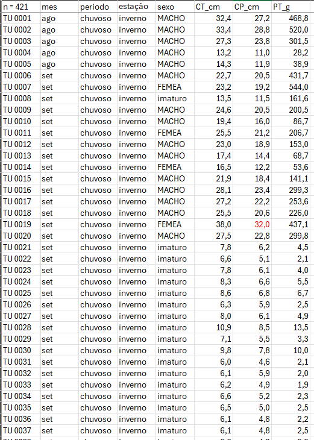

# R Modulo 3.2 - Testes Estatísticos {#univ2}

### RESUMO {-}

A estatística descritiva tem um papel importante a desempenhar na ciência. Quando problemas específicos são tratados na ciência, os dados precisam ser coletados, analisados e apresentados de forma concisa para que outros possam se beneficiar do que foi encontrado.

### Apresentação {-}

A estatística descritiva tem um papel importante a desempenhar na ciência. Quando problemas específicos são tratados na ciência, os dados precisam ser coletados, analisados e apresentados de forma concisa para que outros possam se beneficiar do que foi encontrado. Geralmente não é possível apresentar um conjunto de dados completo em uma publicação ou em um  seminário e, mesmo que fosse, é improvável isso permitisse uma boa comunicação dos resultados da pesquisa. Em vez disso, os dados são geralmente resumidos como tabelas de frequência, histogramas e estatísticas descritivas que os leitores ou ouvintes podem assimilar prontamente, mas que ainda transmitem os elementos essenciais do conjunto de dados original. O principal objetivo do cálculo das estatísticas descritivas é transmitir informações essenciais contidas em um conjunto de dados da forma mais concisa e clara possível. 

## Sobre os dados

Considere os dados merísticos (ou médições morfológicas) da espécie de peixe *Cichla ocellaris* (tucunaré amarelo) do reservatório da barragem  de Gramame, PB [@RN146] (Figura \@ref(fig:rmd32tucu)). Existem 421 medições do comprimemto total (CT), comprimento padrão (CP) e peso total (PT), além do sexo (MACHO, FÊMEA ou imaturo), e outros descritores da estrutura populacional da pespécie, um conjunto de dados formidável. 

```{r rmd232tucu, echo=FALSE, purl=FALSE, fig.cap="Dados merísticos da espécie de peixe *Cichla ocellaris* (tucunaré amarelo) do reservatório da barragem  de Gramame, PB."}

```
  
## Organização básica

```{r, eval=FALSE}
dev.off() #apaga os graficos, se houver algum
rm(list=ls(all=TRUE)) #limpa a memória
cat("\014") #limpa o console 
```

Instalando os pacotes necessários para esse módulo

```{r, eval=FALSE}
install.packages("openxlsx") #importa arquivos do excel
install.packages("fdth")
install.packages("ggpubr")
install.packages("multcomp")
```

```{r}
library(openxlsx)
```

Os códigos acima, são usados para instalar e carregar os pacotes necessários para este módulo. Esses códigos são comandos para instalar pacotes no R. Um pacote é uma coleção de funções, dados e documentação que ampliam as capacidades do R ([R CRAN](https://cran.r-project.org/) [@RN2774] e [RStudio](https://posit.co/download/rstudio-desktop/) [@RN358]). No exemplo acima, o pacote `openxlsx` permite ler e escrever arquivos Excel no R. Para instalar um pacote no R, você precisa usar a função `install.packages()`.

Depois de instalar um pacote, você precisa carregá-lo na sua sessão R com a função `library()`. Por exemplo, para carregar o pacote `openxlsx`, você precisa executar a função `library(openxlsx)`. Isso irá permitir que você use as funções do pacote na sua sessão R. Você precisa carregar um pacote toda vez que iniciar uma nova sessão R e quiser usar um pacote instalado.

Agora vamos **definir o diretório de trabalho**. Esse código é usado para obter e definir o diretório de trabalho atual no R. O comando `getwd()` retorna o caminho do diretório onde o R está lendo e salvando arquivos. O comando `setwd()` muda esse diretório de trabalho para o caminho especificado entre aspas. No seu caso, você deve ajustar o caminho para o seu próprio diretório de trabalho. **Lembre de usar a barra "/" entre os diretórios. E não a contra-barra "\\".**

```{r, eval=FALSE}
getwd()
setwd("C:/Seu/Diretório/De/Trabalho")
```

## Importando a planilha

Vamos importar a planilha de dados univariados `univ*.xlsx`. Note que o símbolo [`#`]{style="color:green"} em programação R significa que o texto que vem depois dele é um comentário e não será executado pelo programa. Isso é útil para explicar o código ou deixar anotações. Ajuste a segunda linha do código abaixo para refletir ["C:/Seu/Diretório/De/Trabalho/Planilha.xlsx"]{style="color:blue"}.

```{r, results='hold'}
library(openxlsx)
univ <- read.xlsx("D:/Elvio/OneDrive/Disciplinas/_EcoNumerica/5.Matrizes/univ.xlsx",
                    rowNames = F, colNames = T,
                    sheet = "tucuna")
head(univ,10)
head(univ[, 1:5], 10)
```

Exibindo os dados importados (esses comando são "case-sensitive" `ignore.case(object)`).

```{r, eval=FALSE, results='hold'}
#View(univ)
print(univ[1:5,1:5])
univ
str(univ)
mode(univ)
class(univ)
```

Vamos escolher uma coluna como a variável de interesse para trabalhar com ela. No código abaixo, essa coluna é descrita pelo seu nome apresentado depois do `$`. Antes do `$` especificamos e qual data frame está a variável. Depois disso, a convertemos para um vertor. 

```{r, results='hold'}
var <- univ$CP_cm
var_v <- as.vector(var)
range(var_v)
```

E agora visualizando nossos dados.

```{r, eval=FALSE, results='hold'}
#View(var)
print(var_v)
var_v
str(var_v)
mode(var_v)
class(var_v)
range(var_v)
```

Por inspeção, o comprimento total mínimo do peixe é `r min(var_v)` cm e o máximo é `r max(var_v)` cm. Esses valores definem o intervalo da amostra. Agora precisamos subdividir os dados em intervalos ou classes, cada um com o mesmo tamanho. Geralmente, é aconselhável arredondar o valor mínimo para baixo e o valor máximo para cima, para valores apropriados ao decidir as classes de intervalos. Nesse caso, parece sensato dividir a faixa de `range(var_v)` cm em sete intervalos a cada 5 cm de largura. Se contarmos o número de peixes que se encontram em cada um dos sete intervalos, temos a base para a tabulação da frequência.

A coluna de frequência será obtida contando o número de medições que existem dentro de cada classe. A coluna de frequência percentual será obtida representando cada contagem como uma porcentagem da contagem total. A frequência cumulativa e as frequências percentuais cumulativas serão obtidas somando progressivamente as frequências correspondentes.

Tendo em mãos o conjunto total de `r length(var_v)` valores merísticos da variável de interesse agora **podemos tirar uma subamostra aleatória de uma parte dos `r length(var_v)` valores**. Essa subamostra é tirada usando o comando `size=` no código subsequente, que estabelece o tamanho da subamostra a ser tirada do total de dados. Esse tamanho é estabelecido no quiz. Inclua esse valor de acordo com o que é pedido no quiz. Por exemplo, se for pedido uma subamostra de 150 comprimentos, então `size = 150`. Nesse tutorial usaremos todos os `r length(var_v)` comprimentos. Podemos ainda escolher uma das colunas da base de dados, no caso desse vamos usar a coluna `r colnames(var_v)`

Subsitua em `n <-` o valor de `size=` desejado. Aqui `n <-` será todo o conjunto de dados `length(var_v)`. 

```{r, results='hold'}
n <- length(var_v)
set.seed(666)
var_sub <- sample(var_v, size = n, replace = F) #atualize o valor de 'size=' se necessário
#OU
#var_sub <- univ[univ$CP_cm >0 & univ$CP_cm <20,] #data.frame
#var_sub <- var_v[var_v>=5 & var_v <=15] #vector
```

Para fazermos uma tabela de frequência dos valores merísticos carregamos o pacote `fdth` e pedimos a função `range` que retorna o valor máximo e mínimo no vetor.

```{r, results='hold'}
library(fdth)
range(var_sub) #retorna o valor máximo e mínimo
#?range
```

Agora é necessário que você substitua os valores de range `r range(var_v)` nos valores de início e fim da distribuição de frequência. Os comandos abaixo criam uma tabela de frequência chamada `tf` com valores máximos e mínimos definidos por `range(var_v)` em intervalor definidos por `h=5`, e o comando `print(tf)` exibe a tabela de frequência.

```{r, results='hold'}
tf <- fdt(var_sub, start=0, end=40, h=5) #tabela de frequência
#?fdt #atente para o uso de k, por exemplo tf <- fdt(var_sub, k=5)
print(tf)
```

Class limits = limites de classe, f = frequência de classe, rf = frequência relativa da classe, rf(%) = frequência relativa percentual da classe, cf = frequência cumulativa da classe, cf(%) = frequência cumulativa percentual da classe.

Se contarmos o número de brotos que se encontram em cada um dos sete intervalos, temos a base para a tabulação da frequência. Essa tabulação é mostrada na tabela gerada pelos códigos acima. A coluna de frequência foi obtida contando o número de medições que existem dentro de cada classe. A coluna de frequência percentual foi obtida representando cada contagem como uma porcentagem da contagem total. A frequência cumulativa e as frequências percentuais cumulativas foram obtidas somando progressivamente as frequências correspondentes.

## Gráficos de histograma e boxplot

No código abaixo se define o layout dos gráficos para serem exibidos lado a lado, e na sequência criamos um gráfico de histograma com base na tabela de frequência `tf`. O comando `boxplot()` cria um gráfico de boxplot para os valores em `var_v`. O argumento "horizontal = TRUE" indica que o boxplot deve ser horizontal.

```{r, results='hold'}
par(mfrow = c(1,2)) #gráficos lado a lado
plot(tf) #distribuição de frequências
boxplot(var_sub, horizontal = TRUE,
        xlab="Class limits") #boxplot
par(mfrow = c(1,1)) #gráficos de volta ao normal
```

::: {#hello .greeting .message style="color: black;"}
[IMPORTANTE]{style="color:red"}
Se você recebeu a mensagem de erro ["Error in plot.new() : figure margins too large"]{style="color:red"}, aumente o tamanho da janela do gráfico e execute as últimas três linhas de comando novamente.
:::

## Sumário estatístico geral

```{r, results='hold'}
summary(var_sub)
#?summary
sd(var_sub) #desvio padrão
var(var_sub) #variância
```

## Testando normalidade

### Q-Q plots

```{r, results='hold', fig.height=8}
par(mfrow=c(3,1))
qqnorm(var_sub, main='Normal')
qqline(var_sub)
boxplot(var_sub, horizontal = TRUE,
        xlab="Class limits") #boxplot
hist(var_sub)
par(mfrow=c(1,1))
library(ggpubr)
ggdensity(var_sub)
ggqqplot(var_sub)
library(car)
qqPlot(var_sub)
```

### Testes de Shapiro-Wilk e Kolmogorov-Smirnov

```{r, results='hold'}
shap <- shapiro.test(var_sub)
shap
p <- format(shap$p.value, scientific = FALSE)
p
ks.test(var_sub, "pnorm")
```

## Testando diferenças entre médias

### Testando homogeneidade de variâncias

```{r, results='hold'}
# F-test
#var.test(CT_cm ~ sexo, data = univ) com erro
#Interpretação: Um valor de p maior que o nível de significância de 0.05 significa que, NÃO HÁ diferença significativa entre as duas variâncias.

# Levene
library(car)
#univ$sexo <- as.factor(univ$sexo) #evita o Warning de "group coerced to factor"  
lev <- leveneTest(CT_cm ~ sexo, data = univ)
lev

# Teste de Levene entre dois de tres grupos
machos_CT_cm <- na.omit(univ$CT_cm[univ$sexo == "MACHO"])
femeas_CT_cm <- na.omit(univ$CT_cm[univ$sexo == "FEMEA"])
imat_CT_cm <- na.omit(univ$CT_cm[univ$sexo == "imaturo"])
lev2 <- leveneTest(CT_cm ~ sexo, data = univ[univ$sexo %in% c("MACHO", "FEMEA"), ])
lev2
#Interpretação: Um valor de p maior que o nível de significância de 0.05 significa que, a hipótese nula é mantida e NÃO HÁ diferença significativa entre as variâncias.
univ$sexo <- factor(univ$sexo, levels = c("MACHO", "FEMEA", "imaturo"))
boxplot(CT_cm ~ sexo, data = univ) 
```

### Teste entre duas médias (t-Student)

```{r, results='hold'}
t.test(machos_CT_cm, femeas_CT_cm,
      alternative = c("two.sided", "less", "greater"),
      mu = 0, paired = FALSE, var.equal = FALSE,
      conf.level = 0.95)
```

### Teste entre três médias (ANOVA)

[ANOVA](https://www.r-bloggers.com/2022/05/one-way-anova-example-in-r-quick-guide/)

```{r, results='hold'}
levels(univ$sexo)
univ$sexo <- ordered(univ$sexo,
                         levels = c("MACHO", "FEMEA", "imaturo"))
library(dplyr)
group_by(univ, sexo) %>%
  summarise(
    count = n(),
    mean = mean(CP_cm, na.rm = TRUE),
    sd = sd(CP_cm, na.rm = TRUE)
  )
# Conjunto de gráficos
library("ggpubr")
ggboxplot(univ, x = "sexo", y = "CP_cm",
          color = "sexo", palette = c("#00AFBB", "#E7B800", "#FC4E07"),
          order = c("MACHO", "FEMEA", "imaturo"),
          ylab = "CP_cm", xlab = "Sexo")
ggline(univ, x = "sexo", y = "CP_cm",
       add = c("mean_se", "jitter"),
       order = c("MACHO", "FEMEA", "imaturo"),
       ylab = "Weight", xlab = "Treatment")
boxplot(CP_cm ~ sexo, data = univ,
        xlab = "Sexo", ylab = "CP_cm",
        frame = FALSE, col = c("#00AFBB", "#E7B800", "#FC4E07"))
library(gplots)
plotmeans(CP_cm ~ sexo, data = univ, frame = FALSE,
          xlab = "Sexo", ylab = "CP_cm",
          main="Mean Plot with 95% CI")
# ANOVA
anova <- aov(CP_cm ~ sexo, data = univ)
summary(anova)
#Interpretação: Um valor de p MENOR que o nível de significância de 0.05 significa que,
#EXISTE diferença significativa entre as três grupos de médias.

# Comparações multiplas
TukeyHSD(anova)
library(multcomp)
library(multcomp)
summary(glht(anova, linfct = mcp(sexo = "Tukey")))
# T-test entre pares
pairwise.t.test(univ$CP_cm, univ$sexo,
                 p.adjust.method = "BH")
# Pressupostos
## Homogeneidade de variâncias 
plot(anova, 1) #valores numerados são outliers
library(car)
leveneTest(CP_cm ~ sexo, data = univ)
# ANOVA sem o pressuposto de equalidade de variâncias
oneway.test(CP_cm ~ sexo, data = univ)
# Testes pareados sem o pressuposto de equalidade de variâncias
pairwise.t.test(univ$CP_cm, univ$sexo,
                p.adjust.method = "BH", pool.sd = FALSE)
# Normalidade pelos resíduos (Q-Q plot)
plot(anova, 2)
# Extraindo os resíduos e rodando o Shapiro-Wilk neles
anova_residuals <- residuals(object = anova)
shapiro.test(x = anova_residuals)
# ANOVA não-paramétrica (Kruskal-Wallis)
kruskal.test(CP_cm ~ sexo, data = univ)

```

### Teste entre três médias e dois fatores (Two-Way ANOVA)

[Two-way ANOVA](https://www.r-bloggers.com/2022/05/two-way-anova-example-in-r-quick-guide/)

```{r, results='hold'}
univ$sexo <- factor(univ$sexo,
                  labels = c("MACHO", "FEMEA", "imaturo"))
univ$periodo <- factor(univ$periodo,
                  labels = c("chuvoso", "seco"))
str(univ)
table(univ$sexo,univ$periodo)

library("ggpubr")
ggboxplot(univ, x = "sexo", y = "CP_cm", color = "periodo",
          palette = c("#00AFBB", "#E7B800"))
ggline(univ, x = "sexo", y = "CP_cm", color = "periodo",
       add = c("mean_se", "dotplot"),
       palette = c("#00AFBB", "#E7B800"))
boxplot(CP_cm ~ periodo * sexo, data=univ, frame = FALSE,
        col = c("#00AFBB", "#E7B800"), ylab="CP_cm")

# Gráfico das interações
interaction.plot(x.factor = univ$sexo, trace.factor = univ$periodo,
                 response = univ$CP_cm, fun = mean,
                 type = "b", legend = TRUE,
                 xlab = "Sexo", ylab="CP_cm",
                 pch=c(1,19), col = c("#00AFBB", "#E7B800"))
# ANOVA Two-way
anova2 <- aov(CP_cm ~ periodo + sexo, data = univ)
summary(anova2)

#The above-fitted model is not referred to as an additive model.
#It is presumptively assumed that the two-factor variables are unrelated.
#Replace the plus symbol (+) with an asterisk (*) if you think
#these two variables will interact to create a synergistic effect.

anova3 <- aov(CP_cm ~ periodo * sexo, data = univ)
summary(anova3)

require("dplyr")
group_by(univ, periodo, sexo) %>%
  summarise(
    count = n(),
    mean = mean(CP_cm, na.rm = TRUE),
    sd = sd(CP_cm, na.rm = TRUE)
  )

# Comparações múltiplas pares: Tukey
TukeyHSD(anova3, which = "sexo")

# Comparações múltiplas pares
library(multcomp)
summary(glht(anova2, linfct = mcp(sexo = "Tukey")))

# T-test entre pares
pairwise.t.test(univ$CP_cm, univ$sexo,
                p.adjust.method = "BH")

# Pressupostos
## Homogeneidade de variâncias
plot(anova3, 1)
library(car)
leveneTest(CP_cm ~ periodo*sexo, data = univ)
# Normalidade pelos resíduos (Q-Q plot)
plot(anova3, 2)
# Extraindo os resíduos e rodando o Shapiro-Wilk neles
anova3_residuals <- residuals(object = anova3)
shapiro.test(x = anova3_residuals )

# ANOVA para desenhos não balanceados
library(car)
nb_anova <- aov(CP_cm ~ periodo * sexo, data = univ)
Anova(nb_anova, type = "III")
```

## Correlação e regressão simples

[Correlação e regressão](https://www.r-bloggers.com/2015/11/correlation-and-linear-regression/)

```{r, results='hold', fig.height=10}
df<-data.frame(univ$CT_cm, univ$CP_cm, univ$PT_g)
plot(df[,1:3])
cor(df,method="pearson")
cor(df[,1:3], method="spearman")
cor.test(univ$CT_cm, univ$CP_cm, method="pearson")
cor.test(univ$CT_cm, univ$CP_cm, method="spearman")
m1 <- lm(univ$CT_cm ~ univ$CP_cm, data=univ)
summary(m1)
par(mfrow=c(2,2))
plot(m1)
par(mfrow=c(1,1))
univ$CT_cm <- log(univ$CT_cm)
plot(univ$CT_cm ~ CP_cm, univ)
anova(m1) 
library(car)
Anova(m1)
Anova(m1, white.adjust=TRUE)

univ <- univ[univ$CT_cm!=max(univ$CT_cm),]

```

## Apêndices {-}

## Sites consultados {-}

## Script limpo {-}

Aqui apresento o scrip na íntegra sem os textos ou outros comentários. Você pode copiar e colar no R para executa-lo. Lembre de remover os [`#`]{style=color:green} ou [`##`]{style=color:green} caso necessite executar essas linhas.

```{r, eval=FALSE, echo=FALSE, purl=FALSE}
knitr::purl(input = "03-rmd3_univ2.Rmd", output = "script-rmd3-2.txt", documentation = 0)
Script <- readLines("script-rmd3-2.txt")
Script <- Script[Script != ""]
writeLines(Script, "script-rmd3-2.txt")
cat(Script, sep = "\n")
```

## Referências {-}
