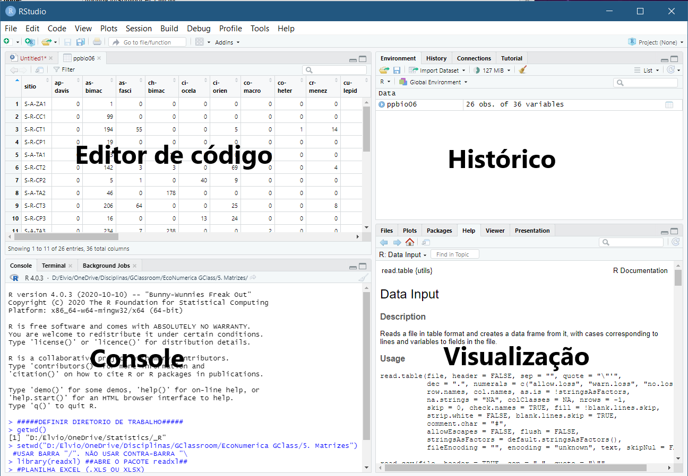
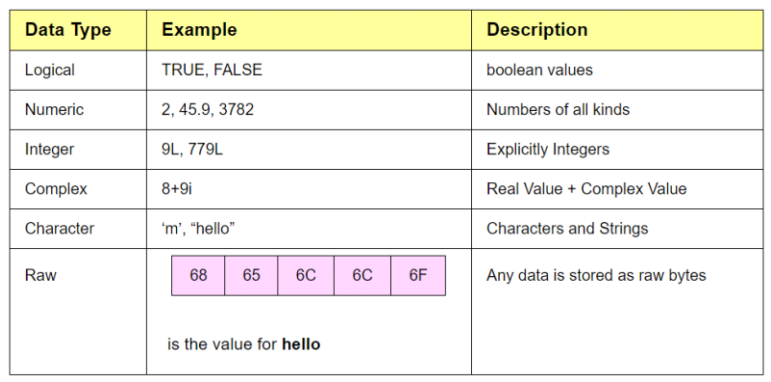
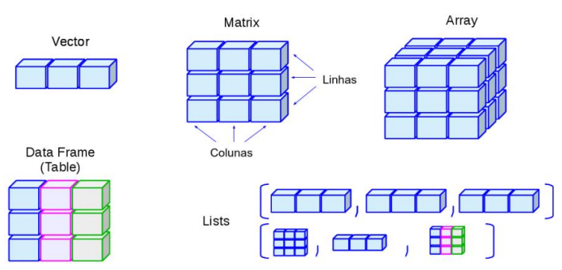

# R Módulo 2 - Tipos de dados no R {#tiposR}

### Apresentação {-}

O R é uma **linguagem de expressão** com uma sintaxe muito simples (veja @RN1787). Ela é sensível a maiúsculas e minúsculas, como a maioria dos pacotes baseados em UNIX, então `A` e `a` são símbolos diferentes e se refeririam a variáveis diferentes. O conjunto de símbolos que podem ser usados nos nomes do R depende do sistema operacional e do país em que o R está sendo executado (tecnicamente, da localidade em uso). Normalmente, todos os símbolos alfanuméricos são permitidos (e em alguns países isso inclui letras acentuadas), além de `.` e `_`, com a restrição de que um nome deve começar com `.` ou uma letra, e se começar com `.`, o segundo caractere não deve ser um dígito. Os nomes são efetivamente ilimitados em comprimento.

::: {#hello .greeting .message style="color: green;"}
  [ATENÇÃO]{style="color:red"}
  Evite usar nomes longos e complicados
:::

**Comandos elementares consistem em expressões ou atribuições**. Se uma `expressão` for dada como um comando, ela é avaliada, impressa (a menos que seja especificamente tornada invisível) e o valor é perdido. Uma `atribuição` também avalia uma expressão e passa o valor para uma variável, mas o resultado não é automaticamente impresso.

Os comandos são separados por um ponto e vírgula (`;`) ou por uma nova linha (`Enter`). Comandos elementares podem ser agrupados em uma única expressão composta por chaves (`{' and '}`).

**Comentários** podem ser colocados em quase qualquer lugar, começando com uma marca de hash (`#`), e tudo até o final da linha é um comentário.

Se um comando não estiver completo no final de uma linha, o R fornecerá um prompt diferente, por padrão `+` (ao invés do tradiocional `>`, nas linhas seguintes e continuará a ler a entrada até que o comando seja sintaticamente completo. Este prompt pode ser alterado pelo usuário. Geralmente, omitiremos o prompt de continuação e indicaremos a continuação apenas recuando.

As linhas de comando digitadas no console são limitadas a cerca de 4095 bytes (não caracteres).

No R, uma linguagem de programação amplamente utilizada para análise de dados e estatísticas, os tipos e estruturas de dados desempenham um papel fundamental na manipulação e organização das informações.

## Tipos e estruturas de dados no R

No R, uma linguagem de programação amplamente utilizada para análise de dados e estatísticas, os tipos e estruturas de dados desempenham um papel fundamental na manipulação e organização das informações. Você vai conhecer esses tipos de  estruturas de dados a seguir, mas antes se familiarize com como o R funciona.

Para começar a usar o R e analisar os dados do Projeto PPBio, abra o RStudio, verifique sua interface (Figura \@ref(fig:interface2)) e siga as instruções a seguir.

```{r interface2, echo=FALSE, purl=FALSE, fig.cap="Interface típica do RStudio e nome dos paineis  ou janelas.", out.width = if (knitr::is_html_output()) "450px" else "10cm", fig.asp=1}

```

## Mensagens de erro e avisos no R

No contexto da linguagem de programação R, mensagens de erro (errors) e mensagens de aviso (warnings) que [aparecem em vermelho no painel de console]{style="color:red"}. Elas são formas de feedback do sistema que indicam problemas ou situações potencialmente problemáticas durante a execução do código. Aqui está uma breve explicação de cada um:

1.  **Erro ([Error]{style="color:red"}):**
    -   Um erro ocorre quando algo no código não está correto ou não pode ser executado como esperado.
    -   Isso pode ser causado por sintaxe incorreta, uso incorreto de funções, operações inválidas, referências a objetos que não existem, entre outros problemas.
    -   Quando ocorre um erro, a execução do código é interrompida e uma mensagem de erro é exibida no console em vermelho, indicando o tipo de erro e, muitas vezes, a linha onde ocorreu.
2.  **Aviso ([Warning]{style="color:red"}):**
    -   Não indica erro. Um aviso é emitido quando algo no código pode resultar em um comportamento indesejado ou em resultados inesperados, mas não interrompe necessariamente a execução do código.
    -   Os avisos geralmente indicam situações que merecem atenção, como conversões de tipos de dados que podem perder informações ou funções que estão sendo usadas de maneira que pode levar a resultados questionáveis.
    -   Os avisos são exibidos em vermelho no console e fornecem informações sobre a natureza do aviso e, possivelmente, como abordá-lo.

É importante prestar atenção a mensagens de erro e avisos, pois eles fornecem insights sobre problemas em seu código ou potenciais fontes de comportamento inesperado. Resolver erros é fundamental para que o código funcione conforme o esperado. Embora os avisos não interrompam a execução, investigá-los pode ajudar a evitar problemas futuros ou melhorar a qualidade do código.

## O que é um `script` e qual sua diferença para um `código`?

Em programação R, tanto "código" quanto "script" se referem a sequências de instruções escritas na linguagem de programação R (veja também [Snippet e chunk][Snippet e chunk]). No entanto, há uma diferença sutil em como esses termos são geralmente usados:

  1. Código:

Em R, "código" geralmente se refere a linhas individuais ou blocos de instruções de programação R que realizam tarefas ou operações específicas.
O código pode ser escrito de forma interativa em um console R ou dentro de um arquivo de script.
O código pode consistir em declarações simples, como atribuir valores a variáveis, realizar cálculos, definir funções ou chamar funções de pacotes.

  2. Script:

Um "script" em R refere-se a um arquivo contendo uma série de instruções de código R.
Scripts R são essencialmente arquivos de texto contendo uma sequência de comandos e declarações R que podem ser executados em conjunto.
Os scripts R permitem que os usuários organizem seu código em unidades reutilizáveis e estruturadas.
Os scripts R geralmente têm a extensão de arquivo ".R".

Em resumo, enquanto "código" se refere a instruções individuais de programação R, "script" se refere a um arquivo contendo uma coleção de código R, geralmente usado para executar tarefas ou análises maiores de forma estruturada e organizada.

Agora você pode começar a escrever seu código no console. Digite "Início do R Módulo" no console clique em `Run` (no canto superior direito do painel de edição de código) ou `Ctrl+Enter` e veja o que acontece:

```{r}
"Início do R Módulo"
```

O R mostra o que você escreveu, e apresenta este `[1]` do lado. Isso significa que seu resultado foi apresentado na primeira linha. Como você pode ver, o R imprime de volta (no Console) o resultado de comandos que você dá. Você agora pode tentar as operações basicas.

```{r}
600+66
```

Cálculos repetitivos podem ser automatizados usando um `loop`

```{r}
x <- 10
x
for (i in 1:5) {x+1->x}
x
```

Aqui o número 1 foi somado cinco vezes ao valor de `x` que foi armazenado cada vez como `x` (substituindo o valor anterior) até chegar em 15. Na prática o R calculou 10+1=11, 11+1=12, 12+1=13, 13+1=14, 14+1=15.

Note que os `:` foi usado para produzir uma seqüência de números de 1 a 5.  

```{r}
1:5
```

O R usa os seguintes símbolos para as operações básicas:

```
`+` Adição
`-` Subtração
`/` Divisão
`*` Multiplicação
`^` Potência
`sqrt` Raiz quadrada (função)
`log` Logarítmo (função)
```

Teste agora outras possibilidades com as operações básicas (veja @RN1484 pags 7-10 para outros exemplos de cáculos básicos).

::: {#hello .greeting .message style="color: green;"}
Você já deve estar percebendo o potencial da programação em R como ferramenta para aprender estatística ou análise de dados, duas áreas com muita demanda de profissionais.
:::

Em sua apostila "*Conversando com o R usando 57 palavras*" @RN2785 ressalta que a programação em R "ajuda no sentido de prover métodos para resolvermos um problema ou entendermos uma análise". Isso porque, primeiro, temos que reunir os elementos fundamentais e informações necessários, depois identificar e dar nomes a esses elementos, para apenas depois disso, decompor nosso problema em suas partes e, finalmente, colocar essas partes em sequência lógica [@RN2785].

A forma linear (passo-a-passo), mas hierarquicamente estruturada, da programação em R, permite uma construção intuitiva e lógica do raciocínio associado a cada análise, que, com o tempo, se torna parte cotidiano das nossas análises de dados. Assim como, na Língua Portuguesa, aprendemos o alfabeto, depois as palavras e eventualmente conversamos sem precisar pensar sobre a gramática e construção das frases.

## Tipos e estruturas de dados no R

O R oferece uma variedade de tipos e estruturas de dados que permitem aos cientistas de dados e analistas manipular e organizar informações de forma eficiente. A escolha da estrutura de dados correta depende das necessidades específicas de análise e do tipo de dados que você está lidando.


1. **Tipos de Dados Básicos**:
   - **Numéricos**: Representam valores numéricos, como inteiros ou números de ponto flutuante.
   - **Caracteres**: Armazenam texto e são usados para representar sequências de caracteres.
   - **Lógicos**: Armazenam valores lógicos (TRUE ou FALSE), úteis para expressar afirmações condicionais.
   - **Complexos**: Armazenam números complexos.

2. **Vetores**:
   - Os vetores são a estrutura de dados mais básica no R.
   - Eles podem conter elementos de um único tipo de dado (exemplo: vetor numérico, de caracteres ou lógico).
   - Os vetores são criados usando a função `c()`.

3. **Matrizes**:
   - Matrizes são vetores bidimensionais, onde os elementos são organizados em linhas e colunas.
   - Todos os elementos de uma matriz devem ser do mesmo tipo de dado.
   - Matrizes podem ser criadas usando a função `matrix()`.

4. **Data Frames**:
   - Data frames são estruturas de dados tabulares semelhantes a planilhas ou tabelas de banco de dados.
   - Cada coluna de um data frame pode conter um tipo de dado diferente.
   - Data frames são amplamente usados para armazenar e manipular conjuntos de dados.
   - São frequentemente criados com funções como `data.frame()` ou lidos de arquivos externos.

5. **Fatores**:
   - Fatores são usados para representar variáveis categóricas ou de fatores.
   - São úteis para análises estatísticas e gráficos.
   - Podem ser criados com a função `factor()`.

6. **Listas**:
   - Listas são estruturas de dados flexíveis que podem conter elementos de diferentes tipos.
   - Os elementos de uma lista podem ser acessados por meio de índices ou nomes.
   - Listas são criadas usando a função `list()`.

7. **Arrays**:
   - Arrays são estruturas multidimensionais que podem conter elementos de um único tipo de dado.
   - São semelhantes às matrizes, mas podem ter mais de duas dimensões.
   - Arrays são criados com a função `array()`.

8. **Tabelas Hash**:
   - Tabelas hash são estruturas de dados que associam chaves a valores.
   - Não são nativas do R, mas podem ser implementadas com pacotes como o `hash`.

## Tipos de dados no R

### Variáveis e tipos básicos de dados (Figura \@ref(fig:nucleos))

1. **Tipos de Dados Básicos**:
   - **Numéricos**: Representam valores numéricos, como inteiros ou números de ponto flutuante.
   - **Caracteres**: Armazenam texto e são usados para representar sequências de caracteres.
   - **Lógicos**: Armazenam valores lógicos (TRUE ou FALSE), úteis para expressar afirmações condicionais.
   - **Complexos**: Armazenam números complexos.

Para guardar os valores em uma variável em R, usamos `<-` (operador de atribuição). Neste caso, o print automático não ocorre, e caso queira checar qual é o valor daquela variável, basta digitar seu nome novamente, ou utilizar o comando `print(nome_da_variavel)`.

Vejamos:

```{r, results='hold'}
a <- 5 + 3
a
print(a)
class(a)
```

Criamos um **objeto** do R chamado `a` que armazena o resultado de `5+3`. Objetos são palavras ou letras às quais são atribuídos dados. A atribuição possibilita a manipulação de dados ou armazenamento dos resultados de análises [@RN2940].

O objeto `a` é uma variável numérica, como você pode ver ao usar a função `class()`. Se quiser trabalhar com inteiros (`integer`), você deve defini-los como `integer`, através da função `as.integer()`.

Vejamos:

```{r, results='hold'}
var1 <- 3
var2 <- as.integer(3)
class(var1)
class(var2)
```

A função `class()` tem o mesmo efeito que a função `mode()`. Faça o teste.

Em R, os dados também podem ser do tipo `character`, que é uma variável de texto (em outras linguagens pode ser conhecida como `string`) e `logical` (que em outras linguagens pode ser conhecida como `boolean`), e que assume os valores `TRUE` ou `FALSE`.

Exemplos:

```{r, results='hold'}
b <- "Ola mundo"
c <- TRUE
class(b)
class(c)
```

::: {#hello .greeting .message style="color: green;"}
Como você já deve ter percebido, uma grande parte da sua interação com o R é feita por comandos ou `funções`, onde cada função realiza um determinado papel. Seja comandar o R a mostrar uma variável recem criada, função `print()`, seja para informar o resultado de uma operação, função `log()`. 
:::

Uma `função` vem sempre seguida de parênteses `()` (no formato, `função(x)`), dentro dos quais colocamos os `argumentos` da função. Os argumentos, por sua vês, devem ser separados por vírgula `,`. Os argumentos são informações adicionais que especificam certas particularidades para serem executadas pelas `funções`. 

Usando a função `log()` como  exemplo, temos:

```{r}
log(x=20, base=10)
```

O argumento `x=` indica de qual valor queremos o log e o argumento `base=` indica qual base para o logaritmo o R vai usar.

Ou, em um segundo caso, podemos ter simplesmente a função sem nenhuma indicação de argumento:

```{r}
log(20)
```

Muitas funções possuem opções padrões (*default*) para alguns de seus argumentos. No caso do log, se não for dado nenhum argumento o `default` do R é usar o log natural do valor entre parêntesis.

## Estruturas de dados no R

Agora vamos falar das estruturas de dados no R (Figura \@ref(fig:tipos)).

2. **Vetores**:
   - Os vetores são a estrutura de dados mais básica no R.
   - Eles podem conter elementos de um único tipo de dado (exemplo: numérico, caracteres ou lógico).
   - Os vetores são criados usando a função `c()`.

Como ja foi dito, os vetores são uma sequência simples de elementos do mesmo tipo. Quando definimos uma variável como fizemos anteriormente, é criado um vetor com um elemento (vetor numérico, vetor de caractere, etc.).

O R opera em **estruturas de dados nomeadas**. A estrutura mais simples é o **vetor numérico**, que é uma entidade única consistindo de uma coleção ordenada de números. Para configurar um vetor chamado x, por exemplo, consistindo de cinco números, a saber, 1.4, 6.5, 3, 4 e 71.2, usa-se o comando R:

```{r}
x <- c(1.4, 6.5, 3, 4, 71.2)
```

Esta é uma instrução de atribuição usando a função `c()` ("combinar"), que neste contexto pode receber um número arbitrário de argumentos de vetor e cujo valor é um vetor obtido pela concatenação de seus argumentos de ponta a ponta.

Observe que o operador de atribuição (`<-`), que consiste nos dois caracteres '<' ("menor que") e '-' ("menos") ocorrendo estritamente lado a lado, e ele "aponta" para o objeto que recebe o valor da expressão. Na maioria dos contextos, o operador '=' pode ser usado como uma alternativa.

Observe:

```{r}
var1 <- 3
is.vector(var1)
```

Isso explica aquele `[1]` que vimos no início do módulo. Quando você associa uma variável dessa forma, o R cria um vetor, e o valor que você definiu será o primeiro item deste vetor.

Para criarmos vetores com mais de um elemento, incluiremos os valores desejados dentro de um `c()` que significa `combinar`.

Veja o exemplo:

```{r, results='hold'}
var1 <- c(3,6, 7.8, 332)
print(var1)
var2 <- c("Ola","tudo","bem")
print(var2)
var3 <- c(TRUE, FALSE, TRUE, TRUE, FALSE, FALSE, TRUE, TRUE, TRUE)
print(var3)
```

Caso você tente misturar os tipos, o R irá forçar para que os elementos sejam 
todos do mesmo tipo. Veja alguns exemplos:

3. **Matrizes**:
   - Matrizes são vetores bidimensionais, onde os elementos são organizados em linhas e colunas.
   - Todos os elementos de uma matriz devem ser do mesmo tipo de dado.
   - Matrizes podem ser criadas usando a função `matrix()`.

As matrizes são estruturas que correspondem às matrizes matemáticas, conjuntos de elementos com linhas e colunas. Assim como os vetores, todos os seus elementos sao do mesmo tipo. Existem algumas formas de criar uma matriz:

```{r}
mat1 <- matrix(c(1,5,10,30,15,8),
 nrow=3,
 ncol=2,
 byrow=TRUE)
print(mat1)
```

Ou

```{r, results='hold'}
vec1 <- c(1, 5)
vec2 <- c(10, 30)
vec3 <- c(15, 8) 
mat2 <- rbind(vec1, vec2, vec3)
print(mat2)
class(mat2)
```

Ou

```{r}
a <- sample(c(0,1,5),10,replace=TRUE)
b <- sample(c(0,10,20),10,replace=TRUE)
c <- sample(c(0,5,10),10,replace=TRUE)
df1 <- data.frame(a,b,c)
df1
```

Na primeira forma, definimos os elementos da matriz, o número de linhas e colunas através dos `argumentos` `nrow` e `ncol`, e se os elementos serão preenchidos ao longo das linhas (`byrow = TRUE`) ou ao longo das colunas (`byrow = FALSE`).

Na segunda forma, criamos dois vetores e então os juntamos através da função `rbind()`. Repare que na segunda matriz, o R nomeou automaticamente as linhas da matriz com os nomes dos vetores, ao invés de definir seus números.

Para selecionar itens de matrizes também utilizamos os colchetes, primeiro especificando a linha e depois a coluna que desejamos retornar:

```{r}
mat1[2][1]
```

4. **Data Frames**:
   - Data frames são estruturas de dados tabulares semelhantes a planilhas ou tabelas de banco de dados.
   - Cada coluna de um data frame pode conter um tipo de dado diferente.
   - Data frames são amplamente usados para armazenar e manipular conjuntos de dados.
   - São frequentemente criados com funções como `data.frame()` ou lidos de arquivos externos.

O `Data Frame` é a estrutura do R utilizada para armazenar elementos em forma de tabela, organizados em linhas e colunas. As colunas e linhas podem ser nomeadas. Você pode criar um data frame com a função `data.frame()`:

```{r}
df1 <- data.frame(c(1,2,3),c("baixo","medio","alto"),c(TRUE, TRUE, FALSE))
print(df1)
```

Ou

```{r, results='hold'}
df2 <- data.frame(Sp1=c(1,5,2,5,3), Sp2=c(21,8,10,7,18)) 
row.names(df2) <- LETTERS[1:5]
df2
```

É possivel plotar esse dataframe:

```{r, results='hold'}
plot(df2, type='n'); text(df2, row.names(df2))
```

`Dataframes` ou `Matrizes` muito grandes são inviáveis de serem inseridas no ambiente do R através de digitação simples como mostrado anteriormente. Uma opção é usar a função `read.table(text="")` e colar a matriz de dados entre as aspas `"..."` 

```{r}
data <- read.table(text = "
Sp1 Sp2 Sp3 Sp4 Sp5 Sp6 Sp7
A 0 0 0 0 0 0 6
B 0 0 0 2 0 0 10
C 93 2 0 177 0 260 2
D 0 4 0 8 0 0 83
E 0 0 0 0 1 0 0
F 0 0 1 0 0 1 0
G 0 2 0 2 0 0 0
", header = TRUE, row.names = 1)
data
```

O R vem com alguns conjuntos de dados organizados em Data Frame na sua base, para a finalidade de testes e aprendizado. Um deles é o `mtcars`:

```{r}
print(mtcars)
```

Algumas funções úteis para conjuntos muito grandes de dados que você deve conhecer:

```{r}
mtcars[1,2]
mtcars["Mazda RX4","gear"]
mtcars[1:5,1]
mtcars[,2]
mtcars[3,]
rownames(mtcars)
mtcars$gear
t(mtcars)
nrow(mtcars)
ncol(mtcars)
mtcars[mtcars<=3]
mtcars[mtcars==0] 
mtcars[mtcars!=0]
length(as.matrix(mtcars))
dim(mtcars)
length(mtcars[mtcars==0])
str(mtcars)
summary(mtcars)
```

As funções `str()` e `summary()` trazem algumas informaçoes úteis sobre o data frame, de uma forma geral. É comum utiliza-las ao importar uma base de dados para o R, para se ter uma ideia do que está sendo analisado. 
O `str()` conta as linhas e colunas e mostra os seus tipos e alguns valores de exemplo. Já o `summary()` traz médias, medianas, máximos, mínimos e quantidade de valores indisponíveis em cada coluna.

5. **Fatores**:
   - Fatores são usados para representar variáveis categóricas ou de fatores.
   - São úteis para análises estatísticas e gráficos.
   - Podem ser criados com a função `factor()`.

Por fim, temos os fatores (`factors`). Fatores são usados para representar categorias. Isso quer dizer que em uma variável do tipo `factor`, aquele valor terá uma quantidade limitada de valores. Pense, por exemplo, nos meses do ano ou letras do alfabeto. Existe um número definido de meses, e o valor estará dentro destas possibilidades. Um nome de uma pessoa, ao contrário, tem infinitas possibilidades, pois não existe uma lista pré-definida de nomes de pessoas, e qualquer um pode criar um novo nome. Para criar um fator, vamos aproveitar o exemplo dos meses do ano e utilizar a função `factor()`:

```{r}
meses <- c("Jan","Jan","Feb","Mar","Apr","Apr","May","Jan","Jan","May","May","Jun")
meses
meses <- factor(meses)
print(meses)
table(meses)
```

Um `vector` ou "vetor"  é uma estrutura de dados fundamental que armazena uma sequência ordenada de elementos do mesmo tipo. Ao imprimir (`print()`) o vetor `meses`, vemos que o R nos indica os níveis (`levels`), que nada mais são do que os valores únicos que existem naquele vetor. Usando a função `table()`, podemos ver a contagem de cada uma das categorias. Vemos que elas estão ordenadas em ordem alfabética.

Como isso pode ser aplicado?

```{r}
meses <- c("Jan", "Jan", "Jan", "Feb", "Feb", "Feb", "Feb", "Mar", "Mar", "Mar", "Apr", "Apr", "Apr", "May", "May", "May", "Jun", "Jun", "Jun")
meses
factor(meses)
print(meses)
table(meses)
riq <- c(3, 5, 7, 6, 8, 9, 0, 4, 6, 9, 2, 6, 3, 9, 6, 0, 1, 6, 7)
dados <- data.frame(Mes = meses, Riqueza = riq)
riq
dados
factor(meses)
plot(factor(meses),riq)
by(riq, meses, mean)
```

Uma situação diferente ocorre quando tem-se colunas com o mesmo nome.

```{r}
df <- data.frame(
  A = c(1, 2, 3),
  B = c(4, 5, 6),
  A = c(7, 8, 9), #nome duplicado
  C = c(0, 0, 1),
  D = c(1, 1, 0),
  E = c(1, 0, 0),
  F = c(11, 12, 13),
  G = c(1, 2, 0),
  E = c(2, 1, 1), #nome duplicado
  check.names = FALSE
)
df
```

Por exemplo, nesse dataframe temos colunas duplicadas. Nesse caso, encontrar e resolver colunas com o mesmo nome é crucial para garantir a integridade dos dados e realizar uma análise precisa. Você deve consolidar essas colunas duplicadas, somando-as ou fazendo sua média. 

```{r, results = 'hold'}
# Achando colunas com nomes duplicados
dup_cols <- names(df)[duplicated(names(df))]
# Somando colunas com o mesmo nome
for (col_name in unique(dup_cols)) {
  # Get indices of columns with the same name
  col_indices <- which(names(df) == col_name)
  # Sum columns with the same name
  df[[col_name]] <- rowSums(df[, col_indices, drop = FALSE])
}
# Remove as colunas duplicadas originais e mantem as novas colunas que são a soma ("except for the first occurrence")
df <- df[, !duplicated(names(df))]
# Mostra a nova tabela com colunas repetidas somadas
print(df)
```

6. Listas

Listas são um tipo especial de vetor, que podem conter elementos de diferentes tipos, incluindo vetores. Veja a lista baseada em alguns vetores, a seguir:

```{r}
a <- c(3,6,9)
b <- c("a","b","c","d")
c <- c(TRUE, FALSE, TRUE, TRUE)
lista1 <- list(a,b,c)
print(lista1)
```

**RESUMO** (De <http://venus.ifca.unican.es/Rintro/dataStruct.html>)

• Vetores: arrays unidimensionais usados para armazenar coleções de dados do mesmo tipo

  ○ Vetores Numéricos (mode: numeric)  
  ○ Vetores Complexos (mode: complex)  
  ○ Vetores Lógicos (mode: logical)  
  ○ Vetor de Caracteres ou strings de texto (mode: character)  

• Matrizes: arrays bidimensionais para armazenar coleções de dados do mesmo modo. São acessados por dois índices inteiros.  
• Arrays: semelhantes a matrizes, mas podem ser multidimensionais (mais de duas dimensões).  
• Fatores: vetores de variáveis categóricas projetados para agrupar os componentes de outro vetor com o mesmo tamanho.  
• Listas: coleção ordenada de objetos, onde os elementos podem ser de tipos diferentes.  
• Data Frames: generalização de matrizes onde diferentes colunas podem armazenar dados de modo diferente.  
• Funcões: objetos criados pelo usuário e reutilizados para realizar operações específicas.  

```{r nucleos, echo=FALSE, purl=FALSE, fig.cap="Resumo visual dos tipos de dados no ambiente de programação R. (De: https://www.tutorialkart.com/r-tutorial/r-data-types)", out.width = if (knitr::is_html_output()) "450px" else "10cm", fig.asp=1}

```

```{r tipos, echo=FALSE, purl=FALSE, fig.cap="Resumo visual dos tipos de dados no ambiente de programação R. (De: https://lhmet.github.io/adar-ebook/estrutura-dados.html)", out.width = if (knitr::is_html_output()) "450px" else "10cm", fig.asp=1}

```

## Como pedir ajuda?

### Dentro do R

No R, você pode solicitar ajuda de várias maneiras:

1. **`help()` ou `?`**:

   Você pode usar a função `help()` seguida pelo nome da função ou pacote sobre o qual você precisa de ajuda. Por exemplo:

```{r, eval=FALSE}
help(mean)
```
   Ou, de forma mais concisa:
```{r, eval=FALSE}
?mean
```

2. **`help.search()`**:

Você pode pesquisar por termos relacionados à sua dúvida usando a função `help.search()`.

```{r, eval=FALSE}
help.search("linear regression")
```

3. **`example()`**:

Para ver exemplos de como usar uma função, você pode usar a função `example()`.

```{r, eval=FALSE}
example(mean)
```

### Fora do R

4. **R Site e Documentação Online**:

O site oficial do R (https://www.r-project.org/) oferece uma vasta documentação, tutoriais e recursos para ajudá-lo a aprender e resolver problemas.

5. **Fóruns e Comunidades Online**:

Existem várias comunidades online onde você pode fazer perguntas e obter ajuda de outros usuários do R, como o Stack Overflow (https://stackoverflow.com/), o RStudio Community (https://community.rstudio.com/), entre outros.

6. **Livros e Tutoriais**:

Existem muitos livros e tutoriais disponíveis que podem ajudá-lo a aprender R, desde os conceitos básicos até técnicas avançadas. Os livros em Português mais importantes são [@RN2941, @RN2940, @RN2942]. 

::: {#hello .greeting .message style="color: green;"}
Ao usar esses recursos, certifique-se de fornecer informações claras sobre sua dúvida ou problema, incluindo detalhes como o código que você está usando, mensagens de erro (se houver) e o que você já tentou fazer para resolver o problema. Isso ajudará os outros a entenderem melhor sua situação e fornecer uma resposta mais útil.
:::

### ChatGPT

Pergunte ao ChatGPT
https://chat.openai.com/

*Para usar o ChatGPT para pedir ajuda ao R, você pode solicitar assistência na elaboração de código, depurar problemas, ou mesmo pedir orientação sobre como realizar uma determinada tarefa em R. Aqui está um exemplo de como você pode pedir ajuda ao R:*

```
Oi ChatGPT! Estou enfrentando um problema ao tentar realizar uma análise de regressão linear no R.
Eu tenho um conjunto de dados chamado "dados.csv" e estou tentando ajustar um modelo linear simples
com a função lm(). No entanto, estou recebendo um erro que não consigo entender.
Você poderia me ajudar a resolver isso?
```

*Ao fazer uma pergunta específica e fornecer detalhes sobre o que você está tentando alcançar e quais problemas está enfrentando, o ChatGPT pode oferecer orientações úteis e sugestões para ajudá-lo com o seu código em R.*

Detalhe, o texto acima foi gerado pelo próprio ChatGPT (Figura \@ref(fig:22chat)). Você pode chamar o ChatGPT pelo próprio R:

```{r, eval=FALSE}
# Abrir o link para o site do ChatGPT
browseURL("https://chat.openai.com/")
```

```{r 22chat, echo=FALSE, purl=FALSE, fig.cap="Usando o ChatGPT para pedir ajuda sobre o R.", out.width = if (knitr::is_html_output()) "450px" else "10cm", fig.asp=1}
knitr::include_graphics("imagens/chatgpt.png")
```

## Work flow

::: {#hello .greeting .message style="color: green;"}
Você já deve estar percebendo que a programação em R pode se tornar confusa, pela quantidade de possibilidades disponíveis e formas diferentes de se obter o mesmo resultado. 
:::

Por isso é necessário que o usuário tenha um workflow que permita o reconhecimento de uma **sequência lógica para estruturar e aplicar** os devidos testes estatísticos e construção de gráficos e tabelas, após a organização e manipulação dos dados. Uma sugestão de workflow preliminar e vista na figura \@ref(fig:22wf) (modificada de @RN2941):

• Carregar os dados  
• Limpar os dados  
• Transformar, visualizar e modelar (fase exploratória)  
• Comunicar o resultado

```{r 22wf, echo=FALSE, purl=FALSE, fig.cap="Exemplo de workflow para análises no R (modificada de [@RN2941])", out.width = if (knitr::is_html_output()) "450px" else "10cm", fig.asp=1}
knitr::include_graphics("imagens/wf.png")
```

## Reconhecendo a estrutura dos dados do R em uma matriz multivariada

### Organização básica

```{r, eval=FALSE}
rm(list=ls(all=TRUE)) #limpa a memória
```

Instalando os pacotes necessários para esse módulo

```{r, eval=FALSE}
install.packages("openxlsx") #importa arquivos do excel
```

```{r}
library(openxlsx)
```

Os códigos acima, são usados para instalar e carregar os pacotes necessários para este módulo. Esses códigos são comandos para instalar pacotes no R. Um pacote é uma coleção de funções, dados e documentação que ampliam as capacidades do R ([R CRAN](https://cran.r-project.org/) [@RN2774] e [RStudio](https://posit.co/download/rstudio-desktop/))  [@RN358]. No exemplo acima, o pacote `openxlsx` permite ler e escrever arquivos Excel no R. Para instalar um pacote no R, você precisa usar a função `install.packages()`.

Depois de instalar um pacote, você precisa carregá-lo na sua sessão R com a função `library()`. Por exemplo, para carregar o pacote `openxlsx`, você precisa executar a função `library(openxlsx)`. Isso irá permitir que você use as funções do pacote na sua sessão R. Você precisa carregar um pacote toda vez que iniciar uma nova sessão R e quiser usar um pacote instalado.

Agora vamos **definir o diretório de trabalho**. Esse código é usado para obter e definir o diretório de trabalho atual no R. O comando `getwd()` retorna o caminho do diretório onde o R está lendo e salvando arquivos. O comando `setwd()` muda esse diretório de trabalho para o caminho especificado entre aspas. No seu caso, você deve ajustar o caminho para o seu próprio diretório de trabalho. **Lembre de usar a barra "/" entre os diretórios. E não a contra-barra "\\".**

Usaremos uma matriz multivariada (sítios x espécies, matriz comunitária) do Projeto PPBio chamada ppbio**.xlsx que está no diretório ["C:/Meu/Diretório/De/Trabalho/Planilha.xlsx"]{style="color:blue"}

Note que o sómbolo `#` em programação R significa que o texto que vem depois dele é um comentário e não será executado pelo programa. Isso é útil para explicar o código ou deixar anotações.

Ajuste a segunda linha do código abaixo para refletir ["C:/Seu/Diretório/De/Trabalho/Planilha.xlsx"]{style="color:red"}.

Definindo o diretório de trabalho e installando os pacotes necessários:

```{r, eval=FALSE}
getwd()
setwd("C:/Seu/Diretório/De/Trabalho")
```

O símbolo `?` é usado para acessar a documentação de uma função ou um pacote no R. Como mostrado acima você pode saber mais sobre a função `getwd()`, usando o comando `?getwd`. Isso vai abrir uma página no menu de ajuda com a descrição, os argumentos, os valores de retorno e os exemplos da função `getwd()`. Você também pode usar o símbolo `?` para obter informações sobre um pacote inteiro. Por exemplo, se você quiser saber mais sobre o pacote `openxlsx`, você pode digitar `?openxlsx`. Isso vai abrir uma página com a visão geral, a instalação, os recursos e as referências do pacote solicitado.

## Importando a planilha

Note que o sómbolo `#` em programação R significa que o texto que vem depois dele é um comentário e não será executado pelo programa. Isso é útil para explicar o código ou deixar anotações. Ajuste a segunda linha do código abaixo para refletir ["C:/Seu/Diretório/De/Trabalho/Planilha.xlsx"]{style="color:blue"}.

```{r, results='hold'}
library(openxlsx)
ppbio <- read.xlsx("D:/Elvio/OneDrive/Disciplinas/_EcoNumerica/5.Matrizes/ppbio06c-peixes.xlsx",
                   rowNames = T,
                   colNames = T,
                   sheet = "Sheet1")
ppbio[1:10, 1:10] #primeiras 10 linhas e 10 colunas da matriz
```

Atente para os resultados dos comandos a seguir.

```{r, results='hold'}
#View(ppbio)
print(ppbio[1:10, 1:10])
#ppbio
str(ppbio)
#?str
mode(ppbio)
#?mode
class(ppbio)
#?class
ppbio_ma <- as.matrix(ppbio) #lê ppbio como uma matriz
str(ppbio_ma)
```

## Apêndices {.unnumbered}

### Snippet e chunk {-}

Em programação R, tanto `snippet` ("trecho de código") quanto `chunk` "pedaço de código" referem-se a porções de código usadas dentro de um contexto maior, geralmente no contexto de sessões interativas ou documentos estruturados como R Markdown. Aqui está como eles diferem:

1. **Snippet**:
   - Um "trecho de código" em R geralmente se refere a um pedaço pequeno e isolado de código que executa uma tarefa ou operação específica.
   - Trechos de código são frequentemente usados de forma interativa, seja em um console R ou dentro de um ambiente de desenvolvimento integrado (IDE) como o RStudio.
   - Esses trechos são geralmente segmentos curtos de código usados para experimentação, testes ou cálculos rápidos.

2. **Chunk**:
   - Um "trecho" em R é um termo comumente usado no contexto da programação literária, especialmente em documentos escritos usando R Markdown.
   - Trechos são blocos maiores de código que podem ser executados independentemente dentro de um documento R Markdown.
   - Os trechos são delimitados por delimitadores especiais, como ```{r}```, que indicam ao processador R Markdown que o conteúdo incluído é código R.
   - Documentos R Markdown permitem a integração de trechos de código R com texto narrativo, permitindo que os usuários combinem código, resultados e texto explicativo em um único documento.

Em resumo, enquanto um "trecho de código" geralmente se refere a uma pequena e isolada peça de código usada para testes ou experimentação, um "trecho" se refere a um bloco maior de código usado dentro do contexto da programação literária, particularmente em documentos escritos usando R Markdown. Os trechos permitem a integração de código e texto narrativo em documentos estruturados.

## Sites consultados {.unnumbered}

Recomendo visitar esses sites e ver demais conteúdos relacionados

Visite:  
https://felipegalvao.com.br/pt/blog/basic-r-introduction-data-types-and-structures/  
https://lhmet.github.io/adar-ebook/datatype.html

Vídeos:  
Objetos, atributos e tipos de dados em R: https://www.youtube.com/watch?v=YdUUQapPYzs&t=1s

Outros materiais de apoio:  
Tipos de dados e operadores I (Parte 8): https://www.youtube.com/watch?v=Dy2cI02WbMQ  
Tipos de dados e operadores II (Parte 9) https://www.youtube.com/watch?v=E6ZTBbicTvg  
Estrutura de dados I (Parte 10): https://www.youtube.com/watch?v=xzlM33Tqvic  
Estrutura de dados I (Parte 11): https://www.youtube.com/watch?v=aEaSzlDMcuI

## Script limpo {-}

Aqui apresento o scrip na íntegra sem os textos ou outros comentários. Você pode copiar e colar no R para executa-lo. Lembre de remover os [`#`]{style=color:green} ou [`##`]{style=color:green} caso necessite executar essas linhas.

```{r, eval=FALSE, echo=FALSE, purl=FALSE}
knitr::purl(input = "3-02-rmd2_tiposR.Rmd", output = "script-3-02-rmd2_tiposR.txt", documentation = 0)
Script <- readLines("script-3-02-rmd2_tiposR.txt")
Script <- Script[Script != ""]
writeLines(Script, "script-3-02-rmd2_tiposR.txt")
cat(Script, sep = "\n")
```

```{r,  eval=FALSE, echo=TRUE, purl=FALSE}
"Início do R Módulo"
600+66
a <- 5 + 3
a
print(a)
class(a)
var1 <- 3
var2 <- as.integer(3)
class(var1)
class(var2)
b <- "Ola mundo"
c <- TRUE
class(b)
class(c)
militares <- c("Soldado","Soldado","Coronel","General","Tenente","Tenente","Cabo","Soldado","Soldado","Cabo","Cabo","Soldado")
militares
militares <- factor(militares)
print(militares)
table(militares)
var1 <- 3
is.vector(var1)
var1 <- c(3,6, 7.8, 332)
print(var1)
var2 <- c("Ola","tudo","bem")
print(var2)
var3 <- c(TRUE, FALSE, TRUE, TRUE, FALSE, FALSE, TRUE, TRUE, TRUE)
print(var3)
mat1 <- matrix(
 c(1,5,10,30,15,8),
 nrow=3,
 ncol=2,
 byrow=TRUE)
print(mat1)
vec1 <- c(1, 5)
vec2 <- c(10, 30)
vec3 <- c(15, 8) 
mat2 <- rbind(vec1, vec2, vec3)
print(mat2)
class(mat2)
mat1[2][1]
a <- c(3,6,9)
b <- c("a","b","c","d")
c <- c(TRUE, FALSE, TRUE, TRUE)
lista1 <- list(a,b,c)
print(lista1)
df1 <- data.frame(c(1,2,3),c("baixo","medio","alto"),c(TRUE, TRUE, FALSE))
print(df1)
print(mtcars)
mtcars[1,2]
mtcars["Mazda RX4","gear"]
mtcars[1:5,1]
mtcars[,2]
mtcars[3,]
nrow(mtcars)
ncol(mtcars)
dim(mtcars)
str(mtcars)
summary(mtcars)
## rm(list=ls(all=TRUE)) #limpa a memória
## install.packages("openxlsx") #importa arquivos do excel
library(openxlsx)
## getwd()
## setwd("C:/Seu/Diretório/De/Trabalho")
library(openxlsx)
ppbio <- read.xlsx("D:/Elvio/OneDrive/Disciplinas/_EcoNumerica/5.Matrizes/bentos06.xlsx",
                   rowNames = T,
                   colNames = T,
                   sheet = "contagem")
ppbio[1:10, 1:10] #primeiras 10 linhas e 10 colunas da matriz
#View(ppbio)
print(ppbio[1:10, 1:10])
#ppbio
str(ppbio)
#?str
mode(ppbio)
#?mode
class(ppbio)
#?class
ppbio_ma <- as.matrix(ppbio) #lê ppbio como uma matriz
str(ppbio_ma)
```

## Referências {-}
