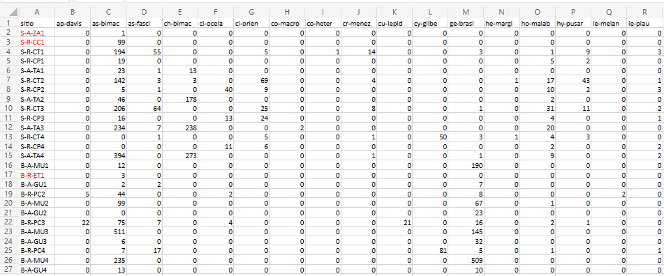
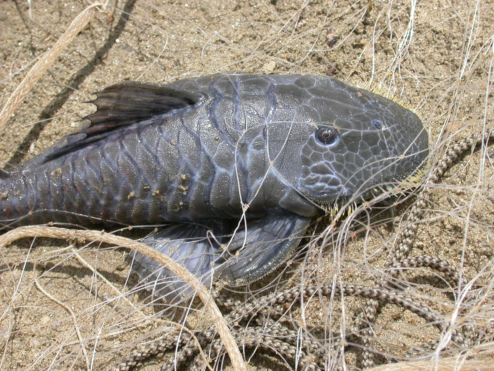

# R Módulo 6 - Análise de outliers baseada no desvio padrão do centróide {#outcentr}

### Apresentação {-}

A análise de outliers baseada no desvio padrão do centróide em análise multivariada é uma técnica utilizada para identificar valores discrepantes em uma matriz de dados com várias variáveis. Essa técnica consiste em calcular o centróide dos dados (ou seja, a média de cada variável), e então calcular o desvio padrão de cada observação em relação ao centróide. Os valores que estão a uma distância maior que um certo número de desvios padrão do centróide são considerados outliers. Essa técnica é útil para identificar observações que podem estar afetando a análise de dados multivariados, como análise de componentes principais, e que podem precisar ser tratadas de forma especial. No entanto, é importante lembrar que a identificação de outliers é uma questão subjetiva e depende do contexto da análise e do objetivo do estudo.

## Sobre os dados do PPBio

Usaremos para esse tutorial dados coletados no Programa de Pesquisa em Biodiversidade - PPBio (Veja [Programa de Pesquisa em Biodiversidade -- PPBio](https://ppbio.inpa.gov.br/Sobre)). Nesta base de dados estão armazenadas informações sobre diversos grupos taxonômicos dstribuidos em diversas unidades amostrais (UA's ou sítios), como peixes, macroinverbrebrados bentônicos, quironomídeos e zooplâncotn, além de dados do habitat, como variáveis físicas e químicas, morfologia do habitat, composição do substrato, estrutura de habitat marginal, entre outros (Figura \@ref(fig:6ppbio)).

```{r 6ppbio, echo=FALSE, purl=FALSE, fig.cap="Parte da planilha de dados brutos do PPBio."}

```

Essa é a **matriz bruta de dados**, porque os valores ainda não foram ajustados para os valores de Captura Por Unidade de Esforço (CPUE), nem foram relativizados ou transformados (Tabela \@ref(tab:6arqs)). As matrizes disponíveis para análises, com suas descrições e tipos de dados recomendados são mostradas na Tabela \@ref(tab:6arqs).

```{r 6arqs, echo=FALSE, purl=FALSE}
arqs <- tibble::tribble(
~"Arquivo (.xlsx)", ~"Tipo de matriz", ~"Descrição", ~"Tipo de dados",
"ppbio06c", "Matriz comunitária", "O arquivo ppbio06 traz os dados brutos que serão usados nas análises. A matriz de dados brutos contendo 26 localidades em estações do ano diferentes (objetos) x 35 espécies (atributos), antes de qualquer modificação.", "Contagens de indivíduos com alta amplitude de variação, sugerido uso de matriz relativizada.",
"ppbio06h", "Matriz ambiental", "O arquivo ppbio06h traz os dados brutos que serão usados nas análises. A matriz de dados brutos contendo 26 localidades em estações diferentes (objetos) x 35 variáveis ambienteis (atributos) medidas em diferentes escalas espaciais, antes de qualquer modificação.", "Unidades de medição diferentes (cm, m, °C, mg/L, etc.), com uma alta amplitude de variação, sugerido uso de matriz transformada e/ou reescalada.",
"ppbio06", "Matriz comunitária", "O arquivo ppbio06 traz os dados brutos que serão usados nessa análise. A matriz de dados brutos contendo 26 locais/ocasiões (objetos) x 35 espécies (atributos), antes de qualquer modificação.", "Contagens de indivíduos com alta amplitude de variação, sugerido uso de matriz relativizada.",
"ppbio06cpue", "Matriz comunitária", "O arquivo ppbio06cpue traz os valores depois de terem sidos ajustados pela Captura Por Unidade de Esforço (CPUE), onde o número de indivíduos de cada espécie em uma determinada UA é dividido pelo esforço de captura daquela UA. Isso significa que os dados foram relativizados pela CPUE. A matriz de dados brutos contendo 26 localidades em estações do ano diferentes (objetos) x 35 espécies (atributos), antes de qualquer modificação.", "Densidades de indivíduos (no. de indivíduos por Unidade de Esforço de Captura) com alta amplitude de variação, sugerido uso de matriz relativizada."
)
library(knitr)
library(kableExtra)
arqsx <- kable(arqs, row.names = FALSE, align="l", booktabs = TRUE, caption = "Exemplos de matrizes disponíveis para análises (PPBio Semiárido), com suas descrições e tipos de dados recomendados.")
arqsx <- kable_styling(arqsx)
column_spec(arqsx, 1:4, width = c("2cm","2cm","7cm","5cm"))
```

A planilha `ppbio` contém o delineamento amostral de um dos estudos do Projeto PPBio (Figura \@ref(fig:6rm1). Nas linhas são apresentadas as abreviações dos nomes das unidades amostrais (UA's) e nas colunas são apresentados os nomes abreviados das espécies - temos portando uma matriz comunitária (\@ref(tab:6arqs). No corpo da planilha temos os valores para o tipo de dados amostrado. Quantitativo, semi-quatitativo ou qualitativo.  
Qual desses tipos de dados você acha que é apresentado na planilha?

```{r 6rm1, echo=FALSE, purl=FALSE, fig.cap="Associação entre a planilha de dados brutos do PPBio e o delineamento amostral do estudo."}
knitr::include_graphics("imagens/rm1.fig3.png")
```

Várias das espécies nessa matriz tem grande importância ecológica, como é o caso de *Astyanax bimaculatus* [^1] (Figura \@ref(fig:6asbim)), que é muito comum em rios intermitentes e serve de alimento para predadores maiores como a espécie *Hoplias malabaricus* [^2] (Figura \@ref(fig:6hmala)).

[^1]: A etimologia do gênero *Astyanax* vem da mitologia Grega. Heitor personagem da "Ilíada", tinha um filho chamado Astíanax.

[^2]: Do Grego, *hoplon*, arma ou armadura, em referência aos dentes caniniformes muito desenvolvidos, e forte estrutura óssea na cabeça. 

```{r 6asbim, echo=FALSE, purl=FALSE, fig.cap="*Astyanax bimaculatus*, a espécie mais comum da matriz de dados ppbio. Peru, by Eakins, R. Fonte: <https://www.fishbase.se/summary/Astianax-bimaculatus.html>"}
knitr::include_graphics("imagens/spp/Asbim_u4.jpg")
```

```{r 6hmala, echo=FALSE, purl=FALSE, fig.cap="*Hoplias malabaricus*, espécie que cresce para se tornar um importante predador. Brazil, by Roselet, F.F.G. Fonte: <https://www.fishbase.se/summary/Hoplias-malabaricus.html>"}
knitr::include_graphics("imagens/spp/Homal_u6.jpg")
```

## Organização básica

```{r, eval=FALSE}
dev.off() #apaga os graficos, se houver algum
rm(list=ls(all=TRUE)) #limpa a memória
cat("\014") #limpa o console
```

Instalando os pacotes necessários para esse módulo

```{r, eval=FALSE}
install.packages("openxlsx") #importa arquivos do excel
install.packages("moments") #calcula assimetria e curtose dos dados
install.packages("matrixStats") #fornece funções rápidas para a estatística de matrizes
install.packages("gt") #ferramenta para criação de tabelas bonitas e personalizáveis
```

Agora vamos **definir o diretório de trabalho**. Esse código é usado para obter e definir o diretório de trabalho atual no R. O comando `getwd()` retorna o caminho do diretório onde o R está lendo e salvando arquivos. O comando `setwd()` muda esse diretório de trabalho para o caminho especificado entre aspas. No seu caso, você deve ajustar o caminho para o seu próprio diretório de trabalho. **Lembre de usar a barra "/" entre os diretórios. E não a contra-barra "\\".**

Definindo o diretório de trabalho e installando os pacotes necessários:

```{r, eval=FALSE}
getwd()
setwd("C:/Seu/Diretório/De/Trabalho")
```

### Importando a planilha

Note que o símbolo [`#`]{style="color:green"} em programação R significa que o texto que vem depois dele é um comentário e não será executado pelo programa. Isso é útil para explicar o código ou deixar anotações.  
	- Ajuste a primeira linha do código abaixo para refletir ["C:/Seu/Diretório/De/Trabalho/Planilha.xlsx"]{style="color:blue"}.  
	- Ajuste o parâmetro `sheet = "Sheet1"` para refletir a aba correta do arquivo .xlsx a ser importado.

Alternativamente você pode ir na barra de tarefas e escolhes as opções:\
SESSION -\> SET WORKING DIRECTORY -\> CHOOSE DIRECTORY

```{r, results='hold'}
library(openxlsx)
m_bruta <- read.xlsx("D:/Elvio/OneDrive/Disciplinas/_EcoNumerica/5.Matrizes/ppbio06c-peixes.xlsx",
                   rowNames = T, colNames = T,
                   sheet = "Sheet1")
str(m_bruta)
m_bruta_ma <- as.matrix(m_bruta) #lê m_bruta como uma matriz
str(m_bruta_ma)
#m_bruta
m_bruta_ma[1:5,1:5] #[1:5,1:5] mostra apenas as linhas e colunas de 1 a 5.
```

## Reset point

::: {#hello .greeting .message style="color: green;"}
[ATENÇÃO]{style="color:red"} Aqui substitui-se uma nova matriz de dados, relativizada e/ou transformada, pela matriz de trabalho inicial.
:::

```{r}
#m_bruta <- (m_bruta)   # <1>
```

1.  Aqui usaremos as matrizes relativizadas/transformadas/particionadas, etc

Podemos exibir a planilha depois de ter sido importada para o ambiente R/RStudio usando as funções `View()`, `print()` ou `head()`. Note que essas funções são case-sensitive. A função `ignore.case()` é uma função do pacote stringr que modifica um padrão para que ele não considere o  caso das letras nas correspondências. Por exemplo, se você quiser encontrar todas as ocorrências da letra "a" em um vetor de caracteres, independente de ser "A" ou "a", você pode usar essa função.

```{r, results='hide'}
#View(m_bruta)
print(m_bruta)
head(m_bruta)
```

A função `head()` no RStudio é uma forma de ver as primeiras (n=6) linhas de um objeto, como um vetor, uma matriz, um data frame ou uma lista. Ela é útil para ter uma ideia do conteúdo e da estrutura do objeto.

Também podemos explorar as características da planilha usando as funções `str()`, `mode()`, `class()` e `length()`. O número de observações ou tamanho do vetor depende do tipo de dados, se eles são uma `matrix` ou um `data.frame`.

```{r, results='hold'}
str(m_bruta)
mode(m_bruta)
class(m_bruta)
#?str
```

O símbolo `?` é usado para acessar a documentação de uma função ou um pacote no R. Como mostrado acima você pode saber mais sobre a função `str()`, usando o comando `?str`. Isso vai abrir uma página no menu de ajuda com a descrição, os argumentos, os valores de retorno e os exemplos da função `str()`. Você também pode usar o símbolo `?` para obter informações sobre um pacote inteiro. Por exemplo, se você quiser saber mais sobre o pacote `openxlsx`, você pode digitar `?openxlsx`. Isso vai abrir uma página com a visão geral, a instalação, os recursos e as referências do pacote solicitado.

Podemos agora calcular o número e a proporção de zeros na matriz usando as funções `sum()` e `length()` (Você pode pesquisar o que faz a função `length()` usando o comando `?length`).

### Tamanho da matriz

```{r, results='hold'}
range(m_bruta) #menor e maior valores
length(m_bruta) #no. de colunas
ncol(m_bruta) #no. de N colunas
nrow(m_bruta) #no. de M linhas
sum(lengths(m_bruta)) #soma os nos. de colunas
length(as.matrix(m_bruta)) #tamanho da matriz m x n
sum(m_bruta == 0) # número de observações igual a zero
sum(m_bruta > 0) # número de observações maiores que zero
zeros <- (sum(m_bruta == 0)/length(as.matrix(m_bruta)))*100 # proporção de zeros na matriz
zeros
```

A matriz de dados apresenta um total de `r length(as.matrix(m_bruta))` valores que variam entre `r range(m_bruta)` (menor e maior valores). A matriz m x n tem `r nrow(m_bruta)` linhas e `r ncol(m_bruta)` colunas. Existem `r sum(m_bruta == 0)` observações iguais a zero e `r sum(m_bruta > 0)` observações maiores que zero, representando um percentual de `r round(zeros,1)`% dos valores sendo zeros.

Essas informações podem ser resumidas na Tabela \@ref(tab:6tbl-tam) que será gerada abaixo.

```{r, results='hold'}
tamanho <- data.frame(
  Comando = c("range", "lenght", "m cols", "n linhas", "Tamanho", "Tamanho",
             "Zeros", "Nao zeros", "% Zeros"),
  Resultado = c(paste(range(m_bruta), collapse = " - "), length(m_bruta), ncol(m_bruta),
                nrow(m_bruta), sum(lengths(m_bruta)), length(as.matrix(m_bruta)), sum(m_bruta == 0),
                sum(m_bruta > 0), round(zeros, 1))
)
tamanho
```

```{r 6tbl-tam, echo=FALSE}
knitr::kable(tamanho, format = "markdown", caption = "Resumo das informações sobre o tamanho da matriz")
```

Ou seja, temos uma matriz de tamanho `m x n` igual a `r nrow(m_bruta)` objetos por `r ncol(m_bruta)` atributos, onde `r round(zeros, 2)`% dos valores da matriz são iguais a zero!

## Cálculo de matriz de distâncias Euclidiana (`euclid`)

Agora vamos calcular a matriz de **distâncias euclidianas** [@RN1278; @RN1336] entre as UA´s usando a função `dist()` (pesquise o que faz essa função usando o comando `?dist`).

```{r}
euclid <- dist(m_bruta, method = "euclidian", diag = TRUE, upper = FALSE)
#?dist
```
<!--- #15.358=Standard deviation e 93.898=Grand mean, eram os  valores originais do PC-ORD para os  dados OakRaw (transformados e relativisados)--->

Pronto, calculamos a matriz de distâncias (Euclidiana). Agora podemos visualizar a matriz.

```{r, results='hold'}
#euclid
str(euclid)
mode(euclid)
class(euclid)
length(as.matrix(euclid))
as.matrix(euclid)[1:6, 1:6] #mostra as 5 primeiras linhas e colunas da matriz
```

Note que a matriz `euclid` está como uma classe `dist`. Uma matriz do tipo `dist` no R é um objeto que armazena as distâncias entre as linhas de uma matriz ou um data frame. Ela é criada pela função `dist()`, que calcula as distâncias usando diferentes medidas, como "euclidean", "manhattan", "canberra", "binary" ou "minkowski" [@RN419] (Figura \@ref(tab:6tbl-dists)).

Visualizando a matriz de distâncias, observamos que ela:

  - é uma matriz quadrada que contém as distâncias entre cada par de elementos do conjuto de dados,
  
  - terá a dimensão m x m (m=linhas, n=colunas) e,
  
  - e cada elemento da matriz será a distância entre cada par de observações ou objetos.
  
A **matriz de distâncias é simétrica**, pois a distância entre i e j é igual à distância entre j e i. A matriz de distâncias também tem **diagonal zero**, pois a distância entre uma observação e ela mesma é zero.

```{r 6tbl-dists, echo=FALSE, purl=FALSE}
dists <- tibble::tribble(
    ~"Distância", ~"Descrição",
      "Euclidiana","Mede a distância entre dois pontos no espaço, seguindo o teorema de Pitágoras. É uma medida de distância direta entre dois pontos.",
      "Manhattan",  "Também conhecida como distância da cidade, mede a distância como se estivesse dirigindo em uma cidade. A distância é a soma das diferenças absolutas de cada coordenada.",
      "Canberra",  "Leva em consideração a proporção de diferenças em relação ao tamanho total das variáveis.",
      "Binária", "Mede a semelhança entre dois objetos. É 0 quando dois valores são iguais e 1 caso contrário.",
      "Minkowski", "É uma generalização da distância euclidiana e da distância de Manhattan. A distância é controlada por um parâmetro P, que determina a ordem da distância."
  )
library(knitr)
library(kableExtra)
distsx <- kable(dists, row.names = FALSE, align = "cl", booktabs = TRUE, caption = "Medidas de distância disponíves na função `dist()` para calcular a distância entre dois pontos ou objetos em um espaço multidimensionl.")
distsx <- kable_styling(distsx, latex_options = "hold_position")
column_spec(distsx, 1:2, width = c("4cm","5cm"))
```

A matriz `euclid` está como uma classe `dist`, mas podemos transformá-la em uma classe `matrix` usando a função `as.matrix()`.

```{r, results='hold'}
euclid_ma <- (as.matrix(euclid))
#View(euclid_ma)
str(euclid_ma)
mode(euclid_ma)
class(euclid_ma)
euclid_ma[1:5, 1:5] #mostra as 5 primeiras linhas e colunas da matriz
```
<!--- Definir qual o jeito correto: Fazer os calculos ma matriz do tipo 'dist' ou na matriz do tipo 'as.matrix'--->

## Calculando o centróide da matriz de distâncias `euclid`

Primeiro algumas informações básicas da matriz

```{r, results='hold'}
range(m_bruta)
range(euclid)
min(euclid)
max(euclid)
mean(euclid) #CENTROIDE!! OU Grand mean
sd(euclid)  #Standard deviation
centroide <- mean(euclid)
centroide
```

A função `mean()` calcula a média de todos os valores da matriz de distâncias, ou seja, a média multivariada, que é o centróide. Nesse caso o **centroide assume o valor de `r round(mean(euclid), 1)`**.

Usamos agora a fórmula `m*(m-1)/2`, onde `m` é o no. de objetos sendo comparados, para calcular quantas distâcias temos na nossa matriz. 

```{r, results='hold'}
length(euclid)
m <- nrow(m_bruta)
m
m*(m-1)/2
summary(euclid)
```

Temos então que m é **`r m` objetos** (ou linhas), e portanto, a matriz de distâncias tem **`r m*(m-1)/2` valores**.

Fazemos agora um breve sumário do que foi calculado até agora com base na matriz de distâncias `euclid`.

```{r, results='hold'}
Sumario1 <- cbind(min(euclid),
                  max(euclid),
                  sd(euclid),
                  mean(euclid),
                  length(euclid))
colnames(Sumario1) <- c("Minimo", "Maximo", "Desv.Padr", "Media", "m(m-1)/2")
rownames(Sumario1) <- ("Valores")
Sumario1
```

## Distribuição de frequências da matriz de distâncias `euclid`

O código abaixo vai plotar um histograma e um boxplot da distribuição de dados armazenada em `euclid`. Também é adicionada uma curva normal teórica ao histograma utilizando a média e o desvio padrão dos dados (Figura \@ref(fig:6euclid)). Atente que o comando `par(mfrow=c(2,1))` define o layout dos gráficos, especificando que serão plotados 2 gráficos em uma coluna. As funções `floor(min(euclid)), ceiling(max(euclid))` definem os limites dos graficos pelo valores mínimo e máximo do objeto (`euclid`).

```{r 6euclid, fig.cap="Distribuições de frequências da matriz de distâncias `euclid`", fig.height=10}
range(euclid)
par(mfrow=c(2,1))
hist(euclid,
     breaks = 15, #determina o no. de colunas do histograma
     xlim = range(floor(min(euclid)), ceiling(max(euclid))), 
     xlab = "Distr. de Frequências",
     freq = FALSE)
curve(dnorm(x, mean=mean(euclid), sd=sd(euclid)), add=TRUE)
boxplot.default(euclid, horizontal = TRUE, frame = FALSE,
                xlab="Distr. de Frequências",
                ylim=c(floor(min(euclid)), ceiling(max(euclid)))) #Limites do eixo Y
```

O comando abaixo apaga os gráficos, use-o apenas se necessário.

```{r, eval=FALSE}
dev.off()
```

## Procurando outliers

### Listas de distâncias

Vamos agora criar uma lista com as distâncias em desvio padrão entre cada objeto e o **centróide**, baseada na matriz de distâncias `euclid_ma` (ou outra matriz de distâncias criada a partir de uma matriz relativizada/transformada ou bruta, dependendo do arquivo escolhido). As distâncias médias do centroide, expressas em desvios padrão, também podem ser chamadas de **z-scores**.

Para esse cálculo é necessário que a matriz de distâncias (do tipo `dist`) seja do tipo `matrix`. Por isso usamos o comando `as.matrix` e removemos a diagonal da nova matriz `euclid_ma`. Códigos a seguir. 

#### Removendo os zeros da matriz de distâncias

```{r, results='hold'}
library(matrixStats)
library(moments)
euclid_ma <- as.matrix(euclid)
euclid_ma
range(euclid_ma) #valor errado
mean(euclid_ma) #valor errado
sd(euclid_ma) #valor errado
is.na(euclid_ma) <- euclid_ma==0 #atribui n.a. aos valores = 0
mean(euclid_ma, na.rm=T)  #valor correto, omite valores n.a. do calculo
mean(euclid_ma, na.rm=T) #valor correto, omite valores n.a. do calculo
sd(euclid_ma, na.rm=T) #valor correto, omite valores n.a. do calculo
#colMeans(euclid_ma, na.rm=T) #omite valores n.a. do calculo
#rowMeans(euclid_ma, na.rm=T) #omite valores n.a. do calculo
```

#### Criando uma Lista

```{r, results='hold'}
centroide_ma <- mean(euclid_ma, na.rm=T)
av.dist <- (as.matrix(colMeans(euclid_ma, na.rm=T)))
av.desvpad <- (as.matrix(colSds(euclid_ma, na.rm=T)))
dp.centroide_ma <- (av.dist-centroide_ma)/(colSds(av.dist)) #ou z-scores
list <- as.matrix(cbind(av.dist, av.desvpad, dp.centroide_ma))
list
```

Ordenamos as distâncias da maior para a menor.

```{r, results='hold'}
colnames(list, do.NULL = FALSE)
colnames(list) <- c("Av.Dist", "Av.StDev", "DP.Centroide")
list2 <- list[order(list[,1], decreasing = TRUE),] #[,1] ou o nome da coluna
list2
```

### Distribuição de frequências das distâncias médias para o centróide `av.dist`

Observe o valor maximo e minimo gerados pela função `range()` e substitua nas linhas de código assinaladas com `#`. Aqui o menor valor foi `r min(list2[, "Av.Dist"])` e o maior valor foi `r max(list2[, "Av.Dist"])`. Use valores maiores para facilitar a visualização no gráfico (Figura \@ref(fig:6avdist)).

```{r 6avdist, results='hold', fig.align='center', fig.height=10, fig.cap="Distribuição de frequências das distâncias médias para o centroide."}
par(mfrow=c(3,1))
hist(list2[, "Av.Dist"],
     breaks = 15, #determina o no. de colunas do histograma
     xlab = "Distr. de Frequências das Distâncias (em dp) para o centroide",
     main = "Distribuição de Frequência da distância média para o centroide",
     xlim = range(floor(min(av.dist)), ceiling(max(av.dist))), #substitua aqui o menor e maior valor do `range()`
     freq = T)
hist(list2[, "Av.Dist"],
     breaks = 15, #determina o no. de colunas do histograma
     xlab = "Distr. de Frequências das Distâncias (em dp) para o centroide",
     main = "Curva de normalidade ajustada para a Distribuição de Frequência",
     xlim = range(floor(min(av.dist)), ceiling(max(av.dist))), #substitua aqui o menor e maior valor do `range()`
     freq = F)
curve(dnorm(x, mean=mean(list2[, "Av.Dist"]), sd=sd(list2[, "Av.Dist"])), add=TRUE)
boxplot.default(list2[, "Av.Dist"], horizontal = TRUE, frame = FALSE,
                xlab="Distr. de Frequências",
                ylim=c(floor(min(av.dist)), ceiling(max(av.dist)))) #substitua aqui o menor e maior valor do `range()`
par(mfrow=c(1,1))
```

#### Distribuição de frequências dos desvios padões das distâncias médias para o centróide `DP.Centroide`

Observe o valor máximo e mínimo gerados pela função `range()` e substitua nas linhas de código assinaladas com `#`. Aqui o menor valor foi `r min(list2[, "DP.Centroide"])` e o maior valor foi `r max(list2[, "DP.Centroide"])`. Use valores maiores para facilitar a visualização no gráfico (Figura \@ref(fig:4centro)).
    
```{r 4centro, results='hold', fig.cap="Distribuição de frequências dos desvios padões das distâncias médias para o centroide.", fig.align='center', fig.height=8}
range(dp.centroide_ma)
par(mfrow=c(3,1))
hist(list2[, "DP.Centroide"],
     breaks = 15, #determina o no. de colunas do histograma
     xlab = "Distr. de Frequências das Distâncias dos desvios padões para o centroide",
     main = "Distribuição de Frequência dos desvio padões das distâncias médias para o centroide",
     xlim = range(floor(min(dp.centroide_ma)), ceiling(max(dp.centroide_ma))), #substitua aqui o menor e maior valor do `range()`
     freq = T)
hist(list2[, "DP.Centroide"],
     breaks = 15, #determina o no. de colunas do histograma
     xlab = "Distr. de Frequências das Distâncias dos desvios padrões das distâncias médias para o centroide",
     main = "Curva de normalidade ajustada para a Distribuição de Frequência",
     xlim = range(floor(min(dp.centroide_ma)), ceiling(max(dp.centroide_ma))), #substitua aqui o menor e maior valor do `range()`
     freq = F)
curve(dnorm(x, mean=mean(list2[, "DP.Centroide"]), sd=sd(list2[, "DP.Centroide"])), add=TRUE)
boxplot.default(list2[, "DP.Centroide"], horizontal = TRUE, frame = FALSE,
                xlab="Distr. de Frequências",
                ylim=c(floor(min(dp.centroide_ma)), ceiling(max(dp.centroide_ma)))) #substitua aqui o menor e maior valor do `range()`
par(mfrow=c(1,1))
```

Se necessário apague os gráficos

```{r, eval=FALSE}
dev.off()
```

## Lista final de outliers

Agora fazemos a lista final de distâncias com os outliers baseados em um 'cutoff'.

```{r}
cutoff <- 2.0
```

Note que o 'cutoff' foi estabelecido no código acima no `vetor` 'cutoff \<-'. Ou seja, o 'cutoff' definindo quem serão considerados outliers, foi estabelecido como sendo valores de **+`r format(cutoff, nsmall = 1)`** e **-`r format(cutoff, nsmall = 1)`** desvios padrões da média multivariada ou centroide. Valores acima ou abaixo do 'cutoff' definido recebem o nome "OUT", na coluna "Outliers". Criada com o código abaixo.

```{r, results='hold'}
library(gt)
format(cutoff, nsmall = 1)
listf <- as.data.frame(list2)
listf$Outliers <- ifelse(listf$DP.Centroide>-cutoff #CUTOFF MENOR QUE -'cutoff
                         & listf$DP.Centroide<cutoff,  #CUTOFF MAIOR QUE 'cutoff'
                         "", "OUT") 
listf
gt(cbind(Sitios=rownames(listf),listf))
```

## Particionando a matriz

Talvez seja necessário particionar a matriz bruta para remover os outliers. Isso pode ser feito com os códigos abaixo. Atente para o `vetor` **`part`**. Ele define quais objetos ou UA's serão particionados.

```{r}
part <- c("B-A-MU4", "B-A-MU3", "S-A-TA4", "S-R-CT3")
part
m_bruta_part <- m_bruta[!(row.names(m_bruta) %in% c(part)),]
#m_bruta_part
```

Criamos uma nova matriz particionada `m_bruta_part` sem **`r part`**, que apresentavam valores acima do cutoff para outliers.

::: {#hello .greeting .message style="color: green;"}
[ATENÇÃO]{style="color:red"}  
Quando deletamos linhas ou colunas da matriz de dados comunitária, precisamos ver se isso não gerou linhas ou colunas vazias. Observe por exemplo a espécie *Apareiodon davisi* [^3] (Figura \@ref(fig:6apdavis)). Por exemplo, se uma determinada espécie só ocorre em uma UA, e aquela UA foi removida, essa espécie não consta mais em nenhuma UA e por isso a sua soma vai ser igual a zero. Isso aconteceu com a espécie *Pseudancistrus genisetiger* [^4] (Figura \@ref(fig:6pgen)). Essa espécie precisará ser removida.
:::

[^3]: A etimologia do nome *Apareiodon* vem do Grego, *a*, sem, *pareia*, lateral ou bochecha, e *odous* dentição, em referencia a ausência de tentes laterais no aparato bucal dessa espécie.

[^4]: A etimologia do nome *Pseudancistrus* vem do Grego, *pseudes*, falso, e *agkistron*, gancho, em referência a falsos ganchos presentes na cabeça em algumas espécies do gênero.

```{r 6apdavis, echo=FALSE, purl=FALSE, fig.cap="*Apareiodon davisi*, importante espécie bentopelágica das bacias dos rios Jaguaribe e Paraíba. Brazil, by Ramos, T.P.A. Fonte: <https://www.fishbase.se/summary/Astianax-bimaculatus.html>"}
knitr::include_graphics("imagens/spp/Apdav_u0.jpg")
```

```{r 6pgen, echo=FALSE, purl=FALSE, fig.cap="*Pseudancistrus genisetiger*, uma espécie endêmica das bacias hidrográfcas do nordeste. By eplanetcatfish.com. Fonte: <https://www.planetcatfish.com> (Provável identificação errada do espécime da foto)](eplanetcatfish.jpg)"}

```

Use o a função `View(m_bruta_part)` e procure linhas ou colunas na matriz `m_bruta_part` onde todos os valores são zero. Quais espécies você encontrou que deixaram de ocorrer na comunidade depois que as UA's outliers foram removidas?.

Complicado? Os códigos abaixo resolvem isso, e mostram algumas propriedades da nova matriz `m_bruta_part2` depois de particionada pela segunda vez para remover linhas/colunas "zeradas".

```{r, results='hold'}
sum <- colSums(m_bruta_part)
sum
zero_sum_cols <- names(which(colSums(m_bruta_part) == 0))
zero_sum_cols #nomes das espécies zeradas
m_bruta_part2 <- m_bruta_part[(colSums(m_bruta_part) != 0)] #em != a exclamação inverte o sentido
zero_sum_cols2 <- names(which(colSums(m_bruta_part2) == 0))
zero_sum_cols2 #nomes das espécies zeradas
sum<-colSums(m_bruta_part2)
sum
#m_bruta_part2
#m_bruta_part2 <- as.matrix(m_bruta_part2)
str(m_bruta_part2)
length(as.matrix(m_bruta_part2))
```

## Exportando a matrix final de trabalho

Agora vamos exportar a matrix de trabalho, nesse casso a matrix `m_bruta_part2`, como um arquivo de valores separados por vírgula (`m_bruta_part2csv.csv`). Na verdade, separado por `";"`, como definido na funçao `sep = ";"`. O arquivo será exportado para o diretório de trabalho. Na mesma sequência de códigos, importamos `m_bruta_part2csv.csv` como nossa matriz de trabalho `m_trab`.

```{r, eval=FALSE}
df <- data.frame(Sites = rownames(m_bruta), m_bruta,
                 row.names = NULL,
                 check.names = FALSE) #add titulo a primeira coluna

write.table(m_bruta_part2, "m_trabcsv.csv",
            sep = ";", dec = ".", #"\t",
            row.names = TRUE,
            quote = TRUE,
            append = FALSE)

m_trab <- read.csv("m_trabcsv.csv",
                   sep = ";", dec = ".",
                   row.names = 1,
                   header = TRUE, 
                   na.strings = NA,
                   check.names = FALSE, #impede que o R mude os nomes das colunas
                   col.names = gsub("(^|_)([a-z])", "\\1\\U\\2",
                                    names(m_trab), perl = TRUE))
```

 - Inicial Maiuscula:col.names = gsub("(^|_)([a-z])", "\\1\\U\\2", names(m_trab), perl = TRUE))  
 - Substituição:     col.names = gsub("-", ".", names(m_trab)))  
 - A função `header=` especifica se o arquivo de entrada contém uma linha de cabeçalho com os nomes das colunas, `row.names` especifica qual coluna no arquivo de entrada deve ser usada como os nomes das linhas, e se `NULL`, os nomes das linhas são gerados como números  

Agora é com você...Refaça toda a análise com a matriz bruta particionada `m_bruta_part2`

## Apêndices {.unnumbered}

### Outras formas de fazer a partição {.unnumbered}

m_bruta_part2 \<- m_bruta_part\[colSums(abs(m_bruta_part), na.rm = F) \> 0\]
m_bruta_part2 \<- subset(m_bruta_part, colSums != 0) m_bruta_part2 \<-
m_bruta_part\[, colSums(m_bruta_part != 0) \> 0\]

### Código {.unnumbered}

range(euclidma) par(mfrow=c(2,1)) hist(euclidma, breaks = 15, #determina
o no. de colunas do histograma xlim = range(floor(min(euclidma)),
ceiling(max(euclidma))), xlab = "Distr. de Frequências", freq = FALSE)
curve(dnorm(x, mean=mean(euclidma), sd=sd(euclidma)), add=TRUE)
boxplot.default(euclidma, horizontal = TRUE, frame = FALSE, xlab="Distr.
de Frequências", ylim=c(floor(min(euclidma)), ceiling(max(euclidma))))

## Script limpo {-}

Aqui apresento o scrip na íntegra sem os textos ou outros comentários. Você pode copiar e colar no R para executa-lo. Lembre de remover os [`#`]{style=color:green} ou [`##`]{style=color:green} caso necessite executar essas linhas.

```{r, eval=FALSE, echo=FALSE, purl=FALSE}
knitr::purl(input = "06-rmd6_outliers.Rmd", output = "script-rmd6.txt", documentation = 0)
Script <- readLines("script-rmd6.txt")
Script <- Script[Script != ""]
writeLines(Script, "script-rmd6.txt")
cat(Script, sep = "\n")
```

```{r,  eval=FALSE, echo=TRUE, purl=FALSE}
## dev.off() #apaga os graficos, se houver algum
## rm(list=ls(all=TRUE)) #limpa a memória
## cat("\014") #limpa o console
## install.packages("openxlsx") #importa arquivos do excel
## install.packages("moments") #calcula assimetria e curtose dos dados
## install.packages("matrixStats") #fornece funções rápidas para a estatística de matrizes
## install.packages("gt") #ferramenta para criação de tabelas bonitas e personalizáveis
## getwd()
## setwd("C:/Seu/Diretório/De/Trabalho")
library(openxlsx)
m_bruta <- read.xlsx("D:/Elvio/OneDrive/Disciplinas/_EcoNumerica/5.Matrizes/peixes06.xlsx",
                   rowNames = T, colNames = T,
                   sheet = "Sheet1")
str(m_bruta)
m_bruta_ma <- as.matrix(m_bruta) #lê m_bruta como uma matriz
str(m_bruta_ma)
#m_bruta
m_bruta_ma[1:5,1:5] #[1:5,1:5] mostra apenas as linhas e colunas de 1 a 5.
#m_bruta <- (m_bruta)   # <1>
#View(m_bruta)
print(m_bruta)
head(m_bruta)
str(m_bruta)
mode(m_bruta)
class(m_bruta)
#?str
range(m_bruta) #menor e maior valores
length(m_bruta) #no. de colunas
ncol(m_bruta) #no. de N colunas
nrow(m_bruta) #no. de M linhas
sum(lengths(m_bruta)) #soma os nos. de colunas
length(as.matrix(m_bruta)) #tamanho da matriz m x n
sum(m_bruta == 0) # número de observações igual a zero
sum(m_bruta > 0) # número de observações maiores que zero
zeros <- (sum(m_bruta == 0)/length(as.matrix(m_bruta)))*100 # proporção de zeros na matriz
zeros
tamanho <- data.frame(
  Função = c("range", "lenght", "m cols", "n linhas", "Tamanho", "Tamanho",
             "Zeros", "Nao zeros", "% Zeros"),
  Resultado = c(paste(range(m_bruta), collapse = " - "), length(m_bruta), ncol(m_bruta),
                nrow(m_bruta), sum(lengths(m_bruta)), length(as.matrix(m_bruta)), sum(m_bruta == 0),
                sum(m_bruta > 0), round(zeros, 1))
)
tamanho
knitr::kable(tamanho, format = "markdown", caption = "Resumo das informações sobre o tamanho da matriz")
euclid <- dist(m_bruta, method = "euclidian", diag = TRUE, upper = FALSE)
#?dist
#euclid
str(euclid)
mode(euclid)
class(euclid)
length(as.matrix(euclid))
as.matrix(euclid)[1:6, 1:6] #mostra as 5 primeiras linhas e colunas da matriz
euclid_ma <- (as.matrix(euclid))
#View(euclid_ma)
str(euclid_ma)
mode(euclid_ma)
class(euclid_ma)
euclid_ma[1:5, 1:5] #mostra as 5 primeiras linhas e colunas da matriz
range(m_bruta)
range(euclid)
min(euclid)
max(euclid)
mean(euclid) #CENTROIDE!! OU Grand mean
sd(euclid)  #Standard deviation
centroide <- mean(euclid)
centroide
length(euclid)
m <- nrow(m_bruta)
m
m*(m-1)/2
summary(euclid)
Sumario1 <- cbind(min(euclid),
                  max(euclid),
                  sd(euclid),
                  mean(euclid),
                  length(euclid))
colnames(Sumario1) <- c("Minimo", "Maximo", "Desv.Padr", "Media", "m(m-1)/2")
rownames(Sumario1) <- ("Valores")
Sumario1
range(euclid)
par(mfrow=c(2,1))
hist(euclid,
     breaks = 15, #determina o no. de colunas do histograma
     xlim = range(floor(min(euclid)), ceiling(max(euclid))), 
     xlab = "Distr. de Frequências",
     freq = FALSE)
curve(dnorm(x, mean=mean(euclid), sd=sd(euclid)), add=TRUE)
boxplot.default(euclid, horizontal = TRUE, frame = FALSE,
                xlab="Distr. de Frequências",
                ylim=c(floor(min(euclid)), ceiling(max(euclid)))) #Limites do eixo Y
## dev.off()
library(matrixStats)
library(moments)
euclid_ma <- as.matrix(euclid)
euclid_ma
range(euclid_ma) #valor errado
mean(euclid_ma) #valor errado
sd(euclid_ma) #valor errado
is.na(euclid_ma) <- euclid_ma==0 #atribui n.a. aos valores = 0
mean(euclid_ma, na.rm=T)  #valor correto, omite valores n.a. do calculo
mean(euclid_ma, na.rm=T) #valor correto, omite valores n.a. do calculo
sd(euclid_ma, na.rm=T) #valor correto, omite valores n.a. do calculo
#colMeans(euclid_ma, na.rm=T) #omite valores n.a. do calculo
#rowMeans(euclid_ma, na.rm=T) #omite valores n.a. do calculo
centroide_ma <- mean(euclid_ma, na.rm=T)
av.dist <- (as.matrix(colMeans(euclid_ma, na.rm=T)))
av.desvpad <- (as.matrix(colSds(euclid_ma, na.rm=T)))
dp.centroide_ma <- (av.dist-centroide_ma)/(colSds(av.dist)) #ou z-scores
list <- as.matrix(cbind(av.dist, av.desvpad, dp.centroide_ma))
list
colnames(list, do.NULL = FALSE)
colnames(list) <- c("Av.Dist", "Av.StDev", "DP.Centroide")
list2 <- list[order(list[,1], decreasing = TRUE),] #[,1] ou o nome da coluna
list2
par(mfrow=c(3,1))
hist(list2[, "Av.Dist"],
     breaks = 15, #determina o no. de colunas do histograma
     xlab = "Distr. de Frequências das Distâncias (em dp) para o centroide",
     main = "Distribuição de Frequência da distância média para o centroide",
     xlim = range(floor(min(av.dist)), ceiling(max(av.dist))), #substitua aqui o menor e maior valor do `range()`
     freq = T)
hist(list2[, "Av.Dist"],
     breaks = 15, #determina o no. de colunas do histograma
     xlab = "Distr. de Frequências das Distâncias (em dp) para o centroide",
     main = "Curva de normalidade ajustada para a Distribuição de Frequência",
     xlim = range(floor(min(av.dist)), ceiling(max(av.dist))), #substitua aqui o menor e maior valor do `range()`
     freq = F)
curve(dnorm(x, mean=mean(list2[, "Av.Dist"]), sd=sd(list2[, "Av.Dist"])), add=TRUE)
boxplot.default(list2[, "Av.Dist"], horizontal = TRUE, frame = FALSE,
                xlab="Distr. de Frequências",
                ylim=c(floor(min(av.dist)), ceiling(max(av.dist)))) #substitua aqui o menor e maior valor do `range()`
par(mfrow=c(1,1))
range(dp.centroide_ma)
par(mfrow=c(3,1))
hist(list2[, "DP.Centroide"],
     breaks = 15, #determina o no. de colunas do histograma
     xlab = "Distr. de Frequências das Distâncias dos desvios padões para o centroide",
     main = "Distribuição de Frequência dos desvio padões das distâncias médias para o centroide",
     xlim = range(floor(min(dp.centroide_ma)), ceiling(max(dp.centroide_ma))), #substitua aqui o menor e maior valor do `range()`
     freq = T)
hist(list2[, "DP.Centroide"],
     breaks = 15, #determina o no. de colunas do histograma
     xlab = "Distr. de Frequências das Distâncias dos desvios padrões das distâncias médias para o centroide",
     main = "Curva de normalidade ajustada para a Distribuição de Frequência",
     xlim = range(floor(min(dp.centroide_ma)), ceiling(max(dp.centroide_ma))), #substitua aqui o menor e maior valor do `range()`
     freq = F)
curve(dnorm(x, mean=mean(list2[, "DP.Centroide"]), sd=sd(list2[, "DP.Centroide"])), add=TRUE)
boxplot.default(list2[, "DP.Centroide"], horizontal = TRUE, frame = FALSE,
                xlab="Distr. de Frequências",
                ylim=c(floor(min(dp.centroide_ma)), ceiling(max(dp.centroide_ma)))) #substitua aqui o menor e maior valor do `range()`
par(mfrow=c(1,1))
## dev.off()
cutoff <- 2.0
library(gt)
format(cutoff, nsmall = 1)
listf <- as.data.frame(list2)
listf$Outliers <- ifelse(listf$DP.Centroide>-cutoff #CUTOFF MENOR QUE -'cutoff
                         & listf$DP.Centroide<cutoff,  #CUTOFF MAIOR QUE 'cutoff'
                         "", "OUT") 
listf
gt(cbind(Sitios=rownames(listf),listf))
part <- c("B-A-MU4", "B-A-MU3", "S-A-TA4", "S-R-CT3")
part
m_bruta_part <- m_bruta[!(row.names(m_bruta) %in% c(part)),]
#m_bruta_part
sum <- colSums(m_bruta_part)
sum
zero_sum_cols <- names(which(colSums(m_bruta_part) == 0))
zero_sum_cols #nomes das espécies zeradas
m_bruta_part2 <- m_bruta_part[(colSums(m_bruta_part) != 0)] #em != a exclamação inverte o sentido
zero_sum_cols2 <- names(which(colSums(m_bruta_part2) == 0))
zero_sum_cols2 #nomes das espécies zeradas
sum<-colSums(m_bruta_part2)
sum
#m_bruta_part2
#m_bruta_part2 <- as.matrix(m_bruta_part2)
str(m_bruta_part2)
length(as.matrix(m_bruta_part2))
## df <- data.frame(Sites = rownames(m_bruta), m_bruta,
##                  row.names = NULL,
##                  check.names = FALSE) #add titulo a primeira coluna
## 
## write.table(m_bruta_part2, "m_trabcsv.csv",
##             sep = ";", dec = ".", #"\t",
##             row.names = TRUE,
##             quote = TRUE,
##             append = FALSE)
## 
## m_trab <- read.csv("m_trabcsv.csv",
##                    sep = ";", dec = ".",
##                    row.names = 1,
##                    header = TRUE,
##                    na.strings = NA,
##                    check.names = FALSE, #impede que o R mude os nomes das colunas
##                    col.names = gsub("(^|_)([a-z])", "\\1\\U\\2",
##                                     names(m_trab), perl = TRUE))
```

## Referências {-}
